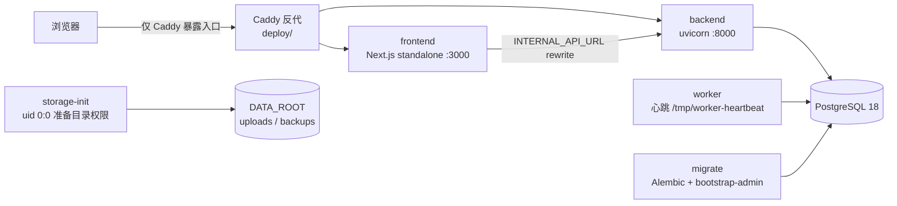
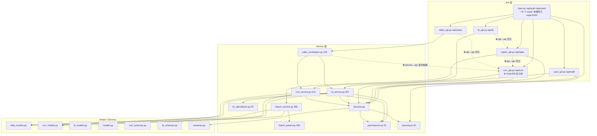

# 好客齐鲁经营管理平台 · 代码健康审计报告（ARCHITECTURE_AUDIT）

- **项目**：好客齐鲁经营管理平台（松茂经营管理平台）
- **审计日期**：2026-09-16
- **审计性质**：**只读**。全程未修改、未删除任何源码；除本报告与三份分项报告（`docs/audit/`）外未写入任何文件；未执行 migration、未 seed、未启动服务。
- **审计目标**：不查代码风格，识别**多个 AI 工具反复迭代后积累的技术债、重复实现、架构混乱与维护风险**。
- **审计组织**：交付总监（齐活林）编排，三名成员分工——架构师（后端与架构主线）、工程师（前端）、QA 工程师（测试/依赖/仓库卫生）。
- **分项报告（证据明细在此）**：
  - `docs/audit/01_backend_architecture.md`（后端与架构主线，23 条）
  - `docs/audit/02_frontend.md`（前端，24 条）
  - `docs/audit/03_tests_deps_risk.md`（测试/依赖/仓库卫生，22 条）

---

## 0. 阅读须知

### 0.1 严重级口径（本次统一）

| 级别 | 定义 |
|---|---|
| **P0** | 造成**不可逆损失**、数据错误、安全事故，或**阻断发布** |
| **P1** | 明确的**功能缺陷**，或**阻碍后续开发**的结构性问题 |
| **P2** | 明显的维护负担 |
| **P3** | 整洁度 / 一致性问题 |

### 0.2 定级校准（相对分项报告的三处调整）

| 条目 | 分项报告定级 | 本报告定级 | 理由 |
|---|---|---|---|
| 架构师 TD-00（`security.py:23` PEP 758 语法） | 原报 **P0**"后端无法启动" | **P3** | **误报，已实测推翻**。项目运行时是 Python 3.14.3，`py_compile` rc=0、`compile()` 通过；无括号 `except A, B:` 是 **Python 3.14 合法语法（PEP 758）**。真实问题是"用了 3.14 专有语法，<3.14 环境硬失败且外观酷似 Python 2 残留" |
| 工程师 FE-01（公海认养筛选失效） | **P0** | **P1** | 是明确功能缺陷（1 行修复），但不是数据错误/安全事故。仍是**最高优先修复项** |
| QA #2（`test_deployment.py` 必红） | **P1** | **P1**（保留） | 但性质由"无法发布"归入"发布门禁失效"，见 P0-2 说明 |

### 0.3 本次审计中由主理人**独立复现**的关键事实

凡涉及"结论会不会影响上线判断"的条目，均由主理人用命令复现，不采信单一成员叙述：

| 复现项 | 命令/证据 | 结果 |
|---|---|---|
| 后端语法错误（架构师原报 P0） | `.venv/Scripts/python.exe -m py_compile apps/backend/app/security.py` | **rc=0，误报** |
| 同文件在低版本解释器 | 托管 Python 3.13.12 同名命令 | `SyntaxError: multiple exception types must be parenthesized`（故降 P3 而非消除） |
| 该写法规模 | 全仓 `grep "except X, Y"` | 全仓**仅 1 处** |
| 测试套件是否真红 | `.venv/Scripts/python.exe -m pytest tests/test_deployment.py -q` | **`1 failed, 1 passed`** → 确认红 |
| 权限不一致 | 逐文件读取 4 处 scope 实现 + `docs/05` 契约 | **确认成立**，且已补文档行号证据 |
| 前端筛选失效 | `grep -n claimFilter` + 依赖数组 | **确认**：`crm.tsx:119` 用 `claimFilter`，`crm.tsx:177` 依赖数组无它 |
| `LAYER_FALLBACK` 缺陷 | `grep -n LAYER_FALLBACK` | **确认**：`:30` 定义常量，`:111/:119` 却写成字符串字面量 |
| 时区硬编码 | `grep -rn "Asia/Shanghai" apps/backend/app` | **确认 4 处**，而 `config.py:12` 已有 `app_timezone` 配置项 |
| 局域网 IP 硬编码 | `cat apps/frontend/next.config.ts` | **确认** `:9 allowedDevOrigins: ["192.168.1.11"]`（同文件其它项都走 env，唯独它写死） |
| 生产镜像是否带测试依赖 | `cat apps/backend/Dockerfile` | **不成立**（QA 已澄清）：runtime 阶段只装 `requirements.lock`，测试依赖在独立 `test` 阶段。**此处要为项目记一分** |
| 用例总数 | `pytest --collect-only -q` | **259 个**（而 `TASK_STATUS.md:7` 写 252、`:23` 写 237、CHANGELOG 写 253+） |

---

## 一、当前系统架构概览

### 1.1 系统定位

**精斗云之上的经营管理平台**——不是替代精斗云，而是承接精斗云导出的经营事实，补上三件精斗云不做的事：

1. **数据接入与核对**：Excel 导入 → 预检 → 幂等入库 → 月度核对（含两份财务报表）
2. **过程 CRM**：客户/潜客/联系人/跟进/待办/商机/公海认领/客户 360
3. **经营分析**：驾驶舱、销售工作台、销售 BI、客户分析（RFM/复购/转化周期/AOV）

### 1.2 技术栈与运行时（实测）

| 层 | 技术 | 版本依据 |
|---|---|---|
| 前端 | Next.js 16.3.4（App Router）+ React 19.2.8 + TypeScript 7.0.2 + ECharts 6.1.0 + **原生 CSS** | `apps/frontend/package.json` |
| 后端 | FastAPI 0.141.1 + SQLAlchemy 2.0.52 + Pydantic 2.13.5 + Uvicorn | `requirements-test.lock` |
| 数据库 | PostgreSQL 18（容器 `postgres:18.4-bookworm`） + Alembic 1.19.2 | `docker-compose.yml`、`apps/backend/requirements.lock` |
| 运行时 | **Python 3.14.3**（`.venv` 实测）、Node 24 | `apps/backend/Dockerfile:1` `FROM python:3.14-slim` |
| 部署 | Docker Compose + Caddy 反代 + worker 心跳 | `docker-compose.yml`、`deploy/` |
| 测试 | pytest（259 例）+ Playwright（9 spec × desktop/mobile） | `pytest --collect-only`、`apps/frontend/e2e/` |

**版本一致性结论**：Python 全链 3.14 一致（`.venv` / Dockerfile / CI `m0.yml:11` / `pyproject.toml:8 target-version="py314"`）。**四处一致，无矛盾**。唯一超前项是前端 `@types/node@26.5.0` 对运行时 Node 24（类型超前，P3）。

### 1.3 部署拓扑



安全边界（实测良好）：postgres / backend / worker / frontend **均无宿主端口**，只经 Caddy；`docker-compose.yml` 网络 `internal: true`；容器日志限 10MB×3；生产强制 HTTPS + 关闭 docs（`config.py:37`、`main.py:27-29`）。

### 1.4 架构形态判定（本次最重要的定性结论）

**表面是规范三层架构，实际是"分层被穿透 + 规则被复制"的架构。**

**好的部分（必须说明，避免过度悲观）**：

| 项 | 证据 |
|---|---|
| 错误结构**全站统一** | `main.py:35-45` 唯一定义 `{error:{code,message,request_id}}`，`main.py:76-83` 统一处理 HTTPException/校验错误，`main.py:48-73` 中间件兜底 500。**无模块自造错误体** |
| **零**未使用 import | 架构师 `ast` 全量扫描，0 命中 |
| 权限**不在前端** | 未发现"前端隐藏按钮=权限"，`sales_workspace.py:261` 明确"身份取自登录 actor，绝不取 query"——符合 AGENTS 铁律 5 |
| 上传安全到位 | `import_api.py:101-105` 文件名白名单（禁 `/` `\` `\x00`）+ 后缀校验；`import_service.py:44-48` `is_relative_to`；`:112-114` `'xb'` 独占写 |
| 密钥与连接串不泄漏 | `config.py:16-17` `SecretStr`；`db.py:11 hide_parameters=True`；`main.py:63-72` 只记 method/status/request_id；`git ls-files` 仅跟踪 `.env.example` |
| 无 SQL 拼接 | 全量 grep `text(f` / `execute(f` / `.format` 无命中注入面 |
| Demo 账号有生产闸门 | `cli.py:44-45` 生产环境 `seed_demo` 抛错 |
| 金额用 Decimal、时区 Asia/Shanghai | `data_models.py` NUMERIC + 后端 `ZoneInfo` |
| Alembic 链完整 | `0001_m0→0002_m1→0003_m2→0004_m2→0005_m3→0006_m5→0007_m5→0008_v11` 无重复、无断链 |
| 依赖极简、无冗余 | 前端仅 4 runtime 依赖；后端 38 个锁包，**无未用依赖** |
| 生产镜像干净 | 多阶段构建，runtime 不含 pytest/ruff/httpx |

**被穿透的部分**：

| 问题 | 证据 |
|---|---|
| **service 层反向依赖 API 层** | `sales_workspace.py:12` `from app.crm_api import Actor, DB` |
| **API 层之间横向互引** | `bi_api.py:10` `from app.import_api import Actor, DB`；`sales_api.py:8` `from app.crm_api import Actor, DB` |
| **DI 别名没有归位** | `Actor`/`DB` 事实上的"共享依赖仓"是 `crm_api.py:15,22`；`main.py:171-189` 把 5 个 router 的 import 全部放到文件末尾并 `# noqa: E402` 屏蔽告警——**用屏蔽告警压住循环依赖，而非解决** |
| **权限规则复制 4 份** | `permissions.py:13-23`、`crm_service.py:84-93`、`bi_service.py:30-38`、`import_api.py:235-246`（详见 §五/§九 P1-07） |
| **业务阈值不落配置** | 时区 4 处、Top-N 5 处、RFM 分层、转化桶、"7 天未跟进"、前 20% 客户阈值全部写在 `bi_service.py` 函数体里，而 `config.py` 里已有 `app_timezone` 却没人用 |

一句话：**这个项目的分层是"文件级分层"，不是"依赖级分层"**——目录看起来规范（api / service / model / schema），但依赖方向没有被守住，所以"改一个权限规则要改 4 个文件、改一次口径要在 2 个模块对齐"。

---

## 二、目录和模块关系

### 2.1 真实体量（不含依赖与构建产物）

```
apps/backend/app/          28 个 py，共 约 4,700 行
  bi_service.py            907  ← 全仓最大
  crm_service.py           613
  import_parser.py         450
  sales_workspace.py       416
  import_service.py        395
  import_api.py            342
  bi_schemas.py            283
  crm_schemas.py           270
  crm_api.py               255
  main.py                  189
  data_models.py           178
  crm_models.py            134
  user_api.py              122
  bi_api.py                102
  cli.py                    99
  services.py               96
  models.py                 71
  bi_calculations.py        67
  sales_api.py              46
  config.py                 46
  schemas.py                43
  bi_models.py              42
  permissions.py            31
  security.py               30
  db.py                     16
  storage_init.py           12
  + bi_metric_catalog.json

apps/backend/alembic/versions/   8 个 migration（0001–0008）
apps/worker/main.py              1 个（仅心跳）
apps/frontend/app/               16 个平铺文件（12 tsx + 3 css + 1 ts）
apps/frontend/e2e/               9 个 spec
tests/                           19 个 py，259 用例
scripts/                         16 个脚本
docs/                            29 个编号文档（00–28）
```

### 2.2 后端依赖关系（含跨层越界标注）



**越界点（全部有行号）**：`sales_workspace.py:12`、`bi_api.py:10`、`sales_api.py:8`。
**修复方向**：抽 `app/deps.py` 收敛 `Actor`/`DB`/`Current`，消除 service↔api 环。

### 2.3 前端结构（抽象层几乎为零）

```
apps/frontend/app/
  page.tsx              209 行/17KB  ← 事实上的路由器（"use client" + useState + location.hash 手写导航）
  sales.tsx             228 行/56KB  ← 销售端独立壳
  crm.tsx               226 行/50KB
  bi.tsx                342 行/39KB
  overview.tsx          309 行/23KB  ← 唯一格式良好的重型页面
  data-center.tsx       137 行/23KB
  staff.tsx              92 行
  customer-analytics.tsx 125 行
  orders-dialog.tsx      53 行
  finance-preview-dialog.tsx 51 行
  login-illustration.tsx 158 行
  layout.tsx / crm-navigation.ts
  globals.css 201 / cockpit.css 330 / sales.css 184
```

**没有 `components/`、没有 `lib/`、没有 `hooks/`、没有 `types/`。** 全部 UI 原语、请求封装、格式化函数、业务类型都散在 12 个页面文件里。这是前端重复问题的**唯一根因**——不是开发者水平问题，是**没有地方放公共代码**。

**路由形态**：只有一个真实路由 `app/page.tsx`，用 `useState(view)` + `location.hash` 手写导航（`page.tsx:23,35-54,157-180`），未使用 Next App Router 的嵌套路由。`page.tsx:156` 按 `role_code === "sales"` 分叉，销售端是**独立壳**（自己一套侧栏/顶栏/主题/CSS）。

**一处易被忽略的资源浪费**：`layout.tsx:2-4` 无条件全局引入 3 个 CSS，导致**销售端专用**的 `sales.css`（26.8KB）也会加载到登录页、驾驶舱、CRM（`FE-18`）。

---

## 三、核心业务模块

| # | 模块 | 关键文件 | 体量 | 职责 | 风险评级 |
|---|---|---|---|---|---|
| 1 | **认证与会话** | `main.py`、`services.py`、`security.py`、`models.py`、`db.py` | 约 400 行 | Argon2id 口令、会话签发/轮换/吊销、登录限流、请求边界中间件、统一错误体 | 中（设计良好，但 `/api/owner/status` 疑似死接口） |
| 2 | **数据导入与核对** | `import_api.py`、`import_service.py`、`import_parser.py`、`data_models.py` | 约 1,365 行 | 上传→SHA256→预检→幂等 Upsert→错误行→批次追溯；财务报表科目勾稽、期间锁定 | 中（解析器有 17 单测，但 14 个端点无 DTO） |
| 3 | **轻量 CRM** | `crm_api.py`、`crm_service.py`、`crm_models.py`、`crm_schemas.py` | 约 1,272 行 | 客户/潜客/联系人/标签/跟进/待办/商机/转交/公海认领/客户 360/审计留痕 | **中-高**（权限越界在此，前端类型漂移在此，e2e 屏蔽也在此） |
| 4 | **销售 BI 与工作台** | `bi_service.py`(907)、`bi_api.py`、`bi_schemas.py`、`bi_calculations.py`、`bi_metric_catalog.json`、`sales_workspace.py`(416)、`sales_api.py` | 约 1,800 行 | 指标计算、环比同比、趋势、RFM/复购/转化周期/AOV、目标、工作日历、团队执行 | **高**（口径重复 4 份、全量加载、N+1、无模块级单测） |
| 5 | **人员与系统配置** | `user_api.py`、`cli.py` | 221 行 | 员工账号增删改停/改密（owner-only）、CLI 恢复路径 | 低-中 |
| 6 | **前端 8 页面** | 见 §2.3 | 约 2,655 行 | 登录/驾驶舱/销售工作台/CRM/BI/数据中心/客户分析/人员管理 | **高**（无抽象层、巨文件、双主题） |
| 7 | **worker** | `apps/worker/main.py` | 单文件 | V1 仅数据库心跳，不处理业务任务 | 低 |

### 3.1 值得单独点出的模块问题

- **`bi_service.py`（907 行 / 全仓最大 / 无模块级单测）**：同时承担"数据装载、口径判定、指标计算、DTO 组装、配置读写、审计"六件事。`load_orders()`(`:206-211`) 把某来源**全部订单**读进内存，`analysis`(`:232-361`)、`overview`(`:752-907`)、`customer_analytics`(`:622-701`)、`workbench`(`:408-431`)、`attention`(`:497-541`) 五个入口各自重新做一遍环比/同比/占比/零除/趋势序列。**这是全项目最贵的一段代码**：既是性能瓶颈，又是"指标口径唯一"（AGENTS 铁律 3）最大威胁，还是重构风险最高的地方（无单测护栏）。
- **`sales_workspace.py`（416 行）**：`sales_workspace.py:128-135` 循环 6 个月，每次调 `bi.analysis(...)` → **6 次全量加载 + 6 次 `review_ready`**（内部各含一次 `latest_fact` 查询）。同时它反向依赖 `crm_api`。
- **CRM 模块的权限越界**：`crm_service.py:85` 让 `admin` 看到全部业务数据，而 `docs/05 §5.5` 明确"管理员不等于天然拥有经营决策权限"。同一个 admin 在 BI/导入模块会被 403。**同一角色、两个模块、相反结果，且无测试覆盖这个交叉点。**
- **"认养"（claim）机制的口径被复制 3 份**：`crm_service.py:63-66`、`bi_service.py:434-436`、`bi_service.py:672-675`。

---

## 四、公共组件和公共服务

### 4.1 后端：服务层"看起来有、实际被绕过"

| 公共服务 | 位置 | 被谁用 | 问题 |
|---|---|---|---|
| 身份与主体 | `services.py:principal_for/authenticate/audit` | 全站 | **唯一较健康的公共设施**，但被绕过的部分见下行 |
| 权限判定 | `permissions.py:13-31` (`can_read_owned`) | `services.py`、`crm_service` | **只被 2 处采用**；`bi_service`、`import_api` 各自重写 |
| 指标公式库 | `bi_calculations.py`（`money/ratio/shift_month/target_metrics/work_dates`） | `bi_service`、`sales_workspace` | **存在但被部分绕过**：多处直接手写 `(a-b)/b*100` 而非调 `ratio` |
| 配置 | `config.py`（`Settings` + `app_timezone`） | 部分 | **`app_timezone` 形同虚设**，4 处硬编码 `Asia/Shanghai` |
| 常量/枚举 | **不存在** | — | 角色串、状态串、等级集合、指标码全为字面量 |
| 依赖注入别名 | `crm_api.py:15,22`（`Actor`/`DB`） | 4 个 API 模块 | **放错位置**，应下沉 `deps.py` |

**结论**：后端**真正缺失的公共服务有 3 个**——① 统一的 `apply_scope()`（数据范围）② 统一的指标公式/口径库（扩展现有 `bi_calculations`）③ 统一常量模块（角色/状态/等级/指标码/阈值）。这三个缺失，直接对应"重复代码"与"硬编码"两大债务。

### 4.2 前端：公共组件层**完全缺失**

应存在但不存在的抽象，以及当前的重复份数：

| 应有 | 现状重复份数 | 代表位置 |
|---|---|---|
| `lib/format.ts`（金额） | **8 份**，且**行为不一致** | `orders-dialog:7`、`finance-preview-dialog:9`、`customer-analytics:14`、`data-center:21`、`crm:25`、`overview:18`、`bi:57`、`sales:36` |
| `lib/api.ts`（请求） | **6 份** | `crm:26`、`staff:10`、`sales:39`、`data-center:22`、`bi:23`、`bi:30`(`useLoad`)/`sales:40`(`useData`) |
| `lib/chart.ts`（ECharts） | **4 份** init/option 样板 | `bi:93`、`overview:40`、`customer-analytics:51`、`sales:228` |
| `lib/types.ts`（业务类型） | `Role`×4、`Metric`×4、`Customer`×2、`Task`×2、`Followup`×2、`Source`×3、`Order`×3、`Person`×2（同名异形） | 见 §六 |
| `lib/labels.ts`（枚举中译） | 枚举被翻译 **2~3 次** | `crm:19-21`、`sales:30-33`、`data-center:19-20`、`bi:21`、`crm:221` |
| `components/ui/Dialog` | **4~5 套** | `orders-dialog:40`、`finance-preview-dialog:36`、`bi:257`、`sales:209/210` |
| `components/ui/MetricCard` | **4 套** | `bi:49/204`、`overview:30`、`customer-analytics:85-89` |
| `components/ui/Pager` | **5 套**，文案各不相同 | `bi:53`、`sales:46`、`orders-dialog:49`、`data-center:126/128`、`crm:202` |
| `components/ui/Empty` | **6 套** | `sales:44`、`overview:184/298`、`customer-analytics:121`、`crm:183-185`、`data-center:128`、`staff:82` |
| `components/ui/Loading` / `ErrorState` | 各 **9 套** | 各页各写 `<p role="status">` / `role="alert"` |
| `components/ui/Tabs` | **5 套**，`aria-pressed`/`aria-current` 混用 | `bi:333`、`crm:188`、`data-center:100`、`sales:80`、`overview:293` |
| `components/ui/Chip` | **6 种**视觉 | `crm:54/68`、`globals:186/119`、`cockpit:171`、`sales:49/48` |
| `components/ui/FilterBar` | **6 套** | `crm:193`、`sales:116/120-124`、`bi:333`、`data-center:99`、`overview:261` |
| `components/ui/Bar`（进度条） | 内联重复 **8+ 处** | `bi:148/207/231/232`、`overview:109/150/283`、`sales:132/166` |
| 表格容器 class | **4 套等价类名** | `table-scroll`、`bi-table-wrap`、`customer-table-wrap`、`sales-table-scroll` |

**这是本次审计中"投入产出比最高"的一块**：这 15 个抽象一旦落地，前端重复代码可消除大半，且**每一个都是纯机械抽取、风险低、有 e2e 护栏**。

---

## 五、主要技术债

### 5.1 债务清单（按性质归类，共 66 条：P0×2 / P1×19 / P2×28 / P3×17）

完整条目见 §九。以下为**六大类根因**。

#### 债因一：版本控制与交付可证性失守（最严重，不可逆风险）

- 全仓 **7 次 commit**（2026-09-09 ~ 09-11，作者全是 ZCode），**磁盘上有 81 项未提交变更**（43 已改 + 38 新增）。
- **`git remote -v` 为空——没有任何远端。** 单机磁盘就是全部资产。
- M1、M2、M3、M4 首屏、M5、销售 V1.1、UI 三次改版的**全部工作都不在版本控制里**。
- 直接的连带后果：`.github/workflows/m0.yml` 存在且配置完整，但因为**没有远端，CI 一次都没跑过**；`docker_acceptance.py` 从未执行。

#### 债因二：同一规则多份实现（重复实现类）

后端最典型的是**权限范围判定被写 4 遍**：

| 实现位置 | owner | **admin** | sales | manager(team) | finance(custom) |
|---|---|---|---|---|---|
| `permissions.py:13-23`（权威语义，docstring 写"Admin has system access, **no implicit business access**"） | 全部 | **False** | 本人 | 成员+本人 | 成员 |
| `crm_service.py:84-93` `scope()` | 全部 | **True（全量可见）** ⚠️ | 本人 | 成员+本人 | 成员 |
| `bi_service.py:30-38` `scope()` | 全部 | **403 拒绝** | 本人 | 成员+本人 | 成员 |
| `import_api.py:235-246` `scoped_sales()` | 全部 | **403 + 提示语** | 本人 | 成员+本人 | 成员 |

**判定依据（契约）**：`docs/05_页面与权限矩阵.md:16` = admin「系统管理；**业务数据默认只为运维需要**」；`:241`（§5.5）「管理员具备系统运维能力，但"管理员"不等于天然拥有公司经营决策权限」。
→ **`crm_service.py:85` 是越界的异类**，admin 在 CRM 能读到全部客户/联系人/跟进/商机，在 BI 和导入却被 403。

> **⚠️ 一个重要的诚实补充（主理人裁决，2026-09-16）**：进一步核对后发现，**文档内部本身就没定死 admin 能不能读**——`docs/05` 有三处口径互不相同：
> - `:16` admin =「系统管理；**业务数据默认只为运维需要**」
> - `:241`（§5.5）「管理员具备系统运维能力，但"管理员"不等于天然拥有公司经营决策权限，**UI 可按需要限制**经营驾驶舱」
> - `:211-231` 权限矩阵里 admin 对客户列表 / CRM 扩展信息 / 联系人 / 跟进 / 待办 / 商机 / 商品订单事实**全部标"运维R"**（=运维级读），只对成本毛利与财务标"默认-"
>
> 也就是说**权限矩阵其实允许 admin 运维级读客户**，而 `permissions.py:14` 的 docstring 写的是 "no implicit business access"。**文档先自相矛盾，代码只是把这个矛盾复制成了两种实现。** 因此这不是"某一侧明确违规"，而是"**没有权威口径**"——按 `AGENTS.md` §2，此处应标 `BLOCKED_BUSINESS_DECISION`，**不得由开发者擅自发明规则**，见 §九 P1-07。

次要差异也真实存在：`manager` 且 `scope_type != 'team'` 时，CRM 返回 `in_([])`（什么都看不到），BI 返回 `{self}`（能看到自己的）——**同一身份在两个页面看到不同数据**。

其它重复：

| 重复内容 | 份数 | 位置 | 差异 |
|---|---|---|---|
| 客户名规范化 `normalize_name` | 3 份 / **2 种语义** | `crm_service:164-165`（转全角括号）、`crm_service:248`（内联复制）、`import_service:254`（**不转括号**） | `duplicate_flags` 按 `normalized_name` 查重 → **全角括号重名会漏检** |
| 待办时间窗 today/week/overdue/future/done | 3 份 | `crm_service:488-500`、`sales_workspace:207-213`、`bi_service:497-500` | **"本周"起始定义不一致（已实测校正）**：CRM `crm_service.py:494`（`start -= weekday()` → **周一起**）与 BI `bi_service.py:498`（`today - weekday()` → **周一起**）**一致**；**唯有销售工作台 `sales_workspace.py:210` = `[明天00:00, 明天+7天)` → 明天起，且完全不含今天**。且同行 `:211` 的 `future`（`due_at >= end`）是 `week` 的超集 → 销售端的"本周待办"实为"明天起 7 天的待办" |
| 客户列表查询 | 2 份且漂移 | `crm_service:127-161`、`sales_workspace:143-197` | sales 版 `pool=True` 时丢弃 `level/tag_id` 过滤 |
| claim 认养可见性 | 3 份 | `crm_service:63-66`、`bi_service:434-436`、`bi_service:672-675` | 未复用同一 helper |
| BI 指标派生算法 | **4 份** | `bi_service:232-361`、`:752-907`、`:622-701`、`sales_workspace:260-416` | 6 个月趋势循环出现于 `bi_service:636-649` 与 `:825-831`；`share = x/total*100` 重复 ≥6 处；**只有部分**走 `bi_calculations.ratio` |
| "源销售核对 vs 已确认经营销售"口径分支 | **6 处内联** | `bi_service:241-296/760-783/510-541/583-604`、`workbench:408-431`、`sales_workspace:287-308` | 每个函数独立重判 `verified`，`review_ready` 被反复调用 |
| 分页返回结构 | 5+ 份 | `crm_schemas:221`、`bi_schemas:137/157/170`、`sales_workspace:27/37/47` | 全是 `{rows,total}` 却各定义一遍；另有多个端点返回**裸 list 无 total** |

#### 债因三：前端没有抽象层导致的结构性重复

见 §四.2。根因是**没有 `components/`、`lib/`、`types/` 目录**，所以每个页面只能自建。附带三个真实缺陷（不是风格问题）：

- `customer-analytics.tsx:30` 定义了 `LAYER_FALLBACK = "#a1a1aa"`，但 `:111`/`:119` 写成字符串字面量 `"LAYER_FALLBACK"` → **非法 CSS 颜色，浏览器丢弃 → 未登记分层的 dot 不可见、badge 无底色**。
- `crm.tsx:119` 使用 `claimFilter`，但 `:177` 的依赖数组没有它 → **公海"认养状态"筛选不生效**。
- `crm.tsx:180` 的决策角色下拉只有 5 个值，而后端 `crm_schemas.py:92` 的 Literal 有 7 个 → **`user`/`introducer` 两个合法值前端不可达，用户无法录入**。

#### 债因四：超大文件 + 超长行，使评审/diff/blame 全部失效

| 文件 | 行数 | 字节 | **最长单行** |
|---|---|---|---|
| `sales.tsx` | 228 | 56 KB | **4,790 字符** |
| `crm.tsx` | 226 | 50 KB | **2,753** |
| `bi.tsx` | 342 | 39 KB | **3,656** |
| `sales.css` | 184 | 27 KB | **5,007** |
| `cockpit.css` | 330 | 26 KB | 2,194 |
| `globals.css` | 201 | 23 KB | 1,654 |
| `data-center.tsx` | 137 | 23 KB | 1,750 |

> 证据：`awk 'length($0)>800'` 命中 **28 处**。`overview.tsx`(309 行/23KB/最长 584) 与 `page.tsx` 格式正常——**证明团队有能力写出可维护的重型页面**，超长行集中在销售端与 CRM 后期迭代，与"多工具反复改版、无人统一格式"吻合。

后果很具体：**改一个字段 = 改整行 4,790 字符**，code review 与 `git blame` 失去意义，任何格式化都会产生不可读的巨型 diff。

#### 债因五：硬编码与"配置存在但没人用"

| 位置 | 硬编码 | 违反 AGENTS 铁律 9 | 应有落点 |
|---|---|---|---|
| `bi_service:22`、`crm_service:16`、`import_parser:66`、`import_api:263` | 时区 `Asia/Shanghai` ×4 | **是** | `config.py:12 app_timezone`（**已存在却不用**） |
| `main.py:97` | Alembic 版本串 `"0008_v11"` | **是** | 读 `alembic_version` / 配置项。**下次加 migration，`/health` 直接 503** |
| `schemas.py:43` | `milestone: str = "M3"`（实际已 M4/V1.1） | 是 | 版本常量 |
| `bi_service:293/294/466/480/661/874/898/903` | Top-N、前 20% 客户、"7 天未跟进"、Top5 商品… | **是** | 指标参数（`Settings`） |
| `bi_service:565-575` | `RFM_SEGMENTS` 分层名、`CONVERT_BUCKETS` 转化桶 | 是 | 配置表/常量 |
| `crm_service:19-21`、`:151-154`、`sales_workspace:165` | `DEFAULT_TAGS` 预设标签、等级集合 `{A,B,C,D}` | 是 | 常量模块 |
| `import_parser:16/18-20/174-185/348-358` | 模板版本、行列上限、表头别名、精斗云科目行次映射 | 是（模板耦合） | 模板配置化 |
| `next.config.ts:9` | `allowedDevOrigins: ["192.168.1.11"]` | — | 环境变量（同文件其它项都走 env） |
| `page.tsx:151/180/186` | `© 2024`（当前 2026）、`v0.5.0` ×2 | — | 常量/动态 |
| 全站 | 角色串、状态串、`Metric.unit`、`activity_type` 中译（`crm.tsx:221` 17 种内联在巨行里） | 是 | 枚举/常量模块 |
| 颜色 | CSS 合计 **396 处** hex + tsx 内联 **89 处** | — | 设计令牌 |

**自相矛盾最明显的一处**：`config.py:12` 已经把时区做成了配置项，而 4 个业务文件仍然硬编码 `'Asia/Shanghai'`。

#### 债因六：文档与元数据过期，会**主动误导下一个 AI 工具**

这在本项目不是小事——项目本身就是靠 AI 工具反复迭代的，而**入场文档还在说"只做 M0"**：

| 文件 | 过期内容 | 危害 |
|---|---|---|
| `AGENTS.md:141-142` | "第一次进入仓库：**只执行 M0**…不得主动实现 M1/M2/M3" | **新 AI 工具按此会拒绝实现任何后续功能，或重做 M0** |
| `CODEX_START_HERE.md:18` | "不要自行进入 M1" | 同上 |
| `README.md:3` | 称"当前实现 M0–M3"，实际已含 M4/M5/驾驶舱/销售 V1.1/季度目标 | 状态误判 |
| `MANIFEST.txt` | 19 行，只覆盖到 `docs/11`，实际 `docs/` 有 29 个文档 | 完整性校验失去意义 |
| `CHANGELOG.md` | 66KB / 421 行，出现 **3 个重复的 `# Changelog` 一级标题**（append-only 拼接痕迹） | 与 `TASK_STATUS.md` 职责重叠、双份状态需同步 |
| `TASK_STATUS.md` / CHANGELOG | 用例数写 252 / 237 / 253+，实测 **259** | 验收口径不可靠 |
| `cockpit.css:1` | 注释仍写 "(forest green)"，主题早已蓝白 | 误导 |
| `CHANGELOG.md` | 已有 66KB，单行超长 | 可读性 |

### 5.2 技术债的"复利"关系（为什么必须先修 P0）

```
无远端 + 81 项未提交
   └─→ 没有"改错了能退回去"的能力
        └─→ 不敢动 bi_service(907) / crm.tsx(50KB) / sales.tsx(56KB)
             └─→ 这些文件的重复实现只能继续叠加
                  └─→ 权限/口径规则继续分叉 → 业务数字开始不一致
测试套件当前为红 + CRM 主流程 e2e 被 fixme 屏蔽
   └─→ 就算敢改，也没有可信回归护栏
```

**这两条是其余所有债务的前置条件。**在它们解决之前，任何"重构建议"都是纸面上的。

---

## 六、重复代码列表（合并汇总）

> 后端来自 `docs/audit/01`（D1–D11），前端来自 `docs/audit/02`（§4/§5）。此处按"同一逻辑"重新编号去重。

### 6.1 后端

| 编号 | 重复内容 | 位置 A | 位置 B / C / D | 关键差异 | 级别 |
|---|---|---|---|---|---|
| R-01 | 数据范围（owner/manager/sales/finance/admin）判定 | `permissions.py:13-23` | `crm_service.py:84-93`、`bi_service.py:30-38`、`import_api.py:235-246` | **admin 三处不同**（False / True / 403）；manager 非团队时结果也不同 | **P1** |
| R-02 | 客户名规范化 | `crm_service.py:164-165` | `crm_service.py:248`、`import_service.py:254` | 有无全角括号转换 → 查重漏判 | **P1** |
| R-03 | 待办时间窗 today/week/overdue/future/done | `crm_service.py:488-500`（周一起，正确） | `bi_service.py:497-500`（周一起，一致）、**`sales_workspace.py:207-213`（明天起，偏离）** | CRM 与 BI 一致；**唯 sales 偏离**，且 `week`(明天起) 被 `future`(≥明天) 完全包含 | **P1** |
| R-04 | BI 指标派生（环比/同比/占比/零除/月序列） | `bi_service.py:232-361` | `:752-907`、`:622-701`、`sales_workspace.py:260-416` | 部分走 `ratio`，部分手写 | **P1** |
| R-05 | "已确认经营销售 vs 源销售核对"口径分支 | `bi_service.py:214-229`（已有的辅助函数） | `:241-296`、`:760-783`、`:510-541`、`:583-604`、`workbench:408-431`、`sales_workspace:287-308` | 6 处各自重判 `verified` | **P1** |
| R-06 | 客户列表查询 | `crm_service.py:127-161` | `sales_workspace.py:143-197` | pool 时 level/tag 过滤行为不同；remark 掩码规则不同 | P2 |
| R-07 | claim 认养可见性 | `crm_service.py:63-66` | `bi_service.py:434-436`、`:672-675` | 未复用 helper | P2 |
| R-08 | 分页返回结构 | `crm_schemas.py:221` | `bi_schemas.py:137/157/170`、`sales_workspace.py:27/37/47` | 同一形状各定义一遍 | P2 |
| R-09 | `Person` DTO | `bi_schemas.py:77`（`id,name`） | `crm_schemas.py:200`（`id,display_name,username`） | 同概念不同字段名 | P3 |
| R-10 | `Settings` DTO | `bi_schemas.py` | `crm_schemas.py` | 前端 `bi.tsx:14` 与 `crm.tsx:14` 同名指向两个后端模型 | P3 |
| R-11 | 数据源可见性子查询 | `bi_service.py:126-127` | `bi_service.py:144-148` | distinct 子查询 vs `limit(1)` | P3 |
| R-12 | 指标 code 字面量 | `bi_metric_catalog.json` | 各函数内字符串 | catalog 未生成枚举 | P3 |
| R-13 | 权限辅助函数 | `crm_service.py:41-43 role()` | `bi_service.py:25-27 require()` | 同名同义两份 | P3 |

### 6.2 前端

| 编号 | 重复内容 | 份数 | 位置 | 关键差异 | 级别 |
|---|---|---|---|---|---|
| R-14 | 金额格式化 `money` | **8** | `orders-dialog:7`、`finance-preview-dialog:9`、`customer-analytics:14`、`data-center:21`、`crm:25`、`overview:18`、`bi:57`、`sales:36` | 空值文案 4 种（`—`/`未填写`/`未填报`/`未填报（空白）`）；负号处理仅 3 处正确；前缀仅 sales 加 `¥` | **P1** |
| R-15 | 请求封装 | **6** | `crm:26`、`staff:10`、`sales:39`、`data-center:22`、`bi:23`、`bi:30`/`sales:40` | 前缀写死不同；空 body 的 Content-Type 行为不同；**`useLoad` 用 AbortController，`useData` 只用布尔位**（取消语义分裂） | **P1** |
| R-16 | ECharts init/option/resize | **4** | `bi:93`、`overview:40`、`customer-analytics:51`、`sales:228` | 仅 `overview` 有 rAF 节流；配色硬编码且不一致（`bi` 用 `#2563eb`，`sales` 用 `#0b62d8`） | **P1** |
| R-17 | 日期/时间格式化 | **7** | `page:175`、`staff:8`、`crm:23`、`sales:35`、`overview:257`、`bi:199`、`data-center:128` | `dateStyle` 不一；空值文案不一 | P2 |
| R-18 | 北京时间→datetime-local 换算 | 2 种 | `crm:24`（`+8*3600000`）、`sales:35/189/216`（手写 `+":00+08:00"`） | 均手写偏移，未用 `APP_TIMEZONE` | P2 |
| R-19 | 角色名映射 | 2 | `page:16`、`staff:7`（完全相同）、`sales:83`（再硬编码"销售员"） | 三处不同步 | P2 |
| R-20 | 枚举中英映射 | 枚举被译 2~3 次 | `crm:19-21`、`sales:30-33`、`bi:21`、`crm:221`、`data-center:19-20` | 文案细微差异 | P2 |
| R-21 | 表格容器 class | 4 套等价 | `table-scroll`、`bi-table-wrap`、`customer-table-wrap`、`sales-table-scroll` | 功能相同、各起一名 | P2 |
| R-22 | 进度条（内联宽度） | 8+ | `bi:148/207/231/232`、`overview:109/150/283`、`sales:132/166` | 未抽组件 | P2 |
| R-23 | 组件原语（Dialog/MetricCard/Pager/Empty/Loading/ErrorState/Tabs/Chip/FilterBar） | 各 4~9 套 | 见 §四.2 | 见 §四.2 | P2 |

---

## 七、疑似废弃代码列表

### 7.1 经核实**并非废弃**（纠正审计前的假设，避免误删）

| 对象 | 判定 |
|---|---|
| `bi_calculations.py`（67 行） | **在用**：`bi_service.py:15` 导入 `ZERO/money/ratio/target_metrics/work_dates`；`sales_workspace.py:264+` 经 `bi.*` 调用。**但它被部分绕过**（见 R-04） |
| `import_purge` 生产代码（`import_service.py:362-395`、`import_api.py:152-159`） | **在用且有测试**（`tests/test_import_purge.py`） |
| `crm-navigation.ts`（`CRMEntry`） | **在用**：`page.tsx:11,26`、`crm.tsx:4,92`、`bi.tsx:4,308`、`overview.tsx:3,211` |
| `crm_schemas.Event/OrderSummary/ProductSummary/SalesSummary` | 由 `CustomerDetail` 使用 |
| `cockpit.css:110-146/236-330`、`sales.css:57-106/108-184` | 大段样式**在用**（`overview.tsx`/`bi.tsx`/`sales.tsx`） |

### 7.2 真正的废弃 / 未接线资产

| 对象 | 位置 | 判定依据 | 建议 |
|---|---|---|---|
| **`.visually-hidden`** | `globals.css:79` | tsx 零引用 | 删 |
| **`.contribution-table`** | `cockpit.css:170` | 表格已改 `bi-table-wrap`/`table-scroll` | 删 |
| **`.team-value`** | `cockpit.css:222-224`（3 处 media 覆盖） | 类未定义、tsx 零引用 | 删 |
| **`.login-layout` / `.intro` / `.intro-footer`** | `globals.css:116` | 登录页已改 `.login-page/.login-hero` | 删 |
| **`.login-panel` / `.login-panel .primary`** | `cockpit.css:25` | tsx 从未使用 `.login-panel` | 删 |
| **`.sales-home-grid` / `.sales-stack`** | `sales.css:11-13` | 工作台已改 `wb-*` 布局 | 删 |
| **`.sales-kpis` / `.sales-period` / `.sales-target-self` / `.sales-attention` / `.sales-panel-footer` / `.sales-muted` / `.sales-transactions`** | `sales.css:8/13/18/27-33/56` | tsx 零引用（目标 UI 已移入 `bi.tsx TargetForm`） | 删 |
| **`.legend-old` / `.legend-new`** | `sales.css:170-171` | 图例改用内联样式 | 删 |
| **`.cockpit-fold`** | `cockpit.css:224` | 类未定义、零引用 | 删 |
| **`LAYER_FALLBACK` 常量** | `customer-analytics.tsx:30` | **定义后从未被引用**（两处写成字面量） | 不是删，是**修**（见 P1-02） |
| **约 20 个死 CSS 类** | 上述合计 | 改版残留 | 分批删 + 截图回归 |
| **`actual_cost_amount` 列** | `data_models.py:148`、migration `0002:179` | 全仓**写入 0 次**（成本/毛利按行未实现） | 保留列（数据只增不删），**文档标注未实现** |
| **`scope_type='all'`** | `models.py:37`、`cli.py:53` | **无任何 scope 函数读取 `'all'`**（owner 靠 `role_code` 判定） | 删除枚举值或文档化，避免误导 |
| **`StatusView.milestone = "M3"`** | `schemas.py:43` | 值已过期（实际 M4/V1.1） | 更新或删 |
| **`/api/owner/status`** | `main.py:147-151` | **前端零调用**，仅 `test_integration.py:50` 断言它 | 确认后删除或文档化其用途 |
| **3 个孤立字节码** | `tests/__pycache__/{test_debug_tags,test_debug_tmp,_review_zcode_temp}.pyc` | **无对应 `.py` 源文件**——多 AI 工具临时调试残留 | 清缓存（已忽略，无入库风险） |
| **未使用 import** | 全 `app/**` | ast 扫描 **0 条** | 无需处理（正面） |

---

## 八、高耦合模块

| # | 模块 | 耦合表现 | 为什么危险 | 级别 |
|---|---|---|---|---|
| 1 | **`bi_service.py`（907 行）** | 导入 6 个模块（`bi_calculations`/`services`/`crm_models`/`data_models`/`permissions`/`bi_schemas`）；同时承担装载、口径、计算、DTO、配置、审计六职责；5 个入口各自重算 | **全仓最大 + 无模块级单测**（仅经 `/api/bi` 集成覆盖）→ 改动风险最高、护栏最薄 | **P1** |
| 2 | **`sales_workspace.py`（416 行）** | `:12` **service 反向 import API 层**（`from app.crm_api import Actor, DB`）；同时依赖 `bi_service` 与 `crm_service`（双服务耦合） | 挪动 `Actor/DB` 会连锁；无法独立测试服务层 | **P1** |
| 3 | **`Actor` / `DB` 依赖别名** | 真实定义在 `crm_api.py:15,22`，被 `bi_api.py:10`、`sales_api.py:8`、`sales_workspace.py:12` 反向引用 | 事实上的"共享依赖仓"放错层级，形成 API↔service 环 | **P2** |
| 4 | **`main.py:171-189`** | 5 个 router 的 import 全部放在文件**末尾**并 `# noqa: E402` | 用屏蔽告警压住循环依赖，而非解决；新加 router 的人会照抄这个坏模式 | **P2** |
| 5 | **`crm.tsx`（50KB）** | 单文件含列表/公海/商机/跟进/待办/客户 360/标签管理/批量分配/转交/绑定；`claimFilter` 等 14 项依赖的巨型 `useEffect`(`:177`) | 改一处牵动全域；**核心流程 e2e 还被 fixme 屏蔽** → 最高风险改动区 | **P1** |
| 6 | **`sales.tsx`（56KB）** | 独立壳 + 工作台 + 4 个列表 + 图表 + 表单；单行 4,790 字符 | e2e 断言依赖文案，重构即红 | **P1** |
| 7 | **`page.tsx`（事实路由器）** | `useState(view)` + `location.hash` 手写导航；`:156` 按角色分叉渲染两套壳 | 新增页面/角色的唯一改动点，且没有类型安全的路由表 | P2 |
| 8 | **`sales_workspace.py:128-135`** | 循环 6 个月，每次调 `bi.analysis()` → **6 次全量加载 + 6 次 `review_ready`**（各含 `latest_fact` 查询） | 性能与耦合双重问题 | **P1** |
| 9 | **前后端类型耦合** | 无共享类型源（无 `lib/types.ts`、无 OpenAPI 代码生成），前端手工镜像后端 schema | 后端加字段前端静默漂移（已发生 8 处，见 R-14/§九 P1-04） | **P1** |

---

## 九、P0 / P1 / P2 / P3 问题清单

> **共 66 条：P0 × 2、P1 × 19、P2 × 28、P3 × 17**
> ID 前缀：`B-` 后端（源 `01`）、`F-` 前端（源 `02`）、`Q-` 测试/仓库（源 `03`）。定级已按 §0.1 口径统一。
> **去重说明**：QA 报告的 #20（scope 无一致性测试）、#21（"本周"三端不一致）、#22（import_api 无 response_model）与 §九 的 P1-07、P1-06、P2-01 是**同一问题**，已在对应条目内标注来源，**不重复计数**；QA 独立新增且已并入的条目为 P3-17。

### 9.1 P0（2 条）——先做这两件，其它免谈

| ID | 标题 | 证据 | 影响 | 建议动作 |
|---|---|---|---|---|
| **P0-1** | **全部 M1–M5 成果不在版本控制内，且无任何远端** | `git log` = **7** commit（作者全为 ZCode，止于 2026-09-11）；`git status` = **81** 项（43 改 + 38 新增）；`git remote -v` **为空** | 单机磁盘 = 全部资产。磁盘故障即**不可逆丢失**；CI 永不触发 | ① 建私有远端（Gitee/GitHub private/自建均可）② **分批**提交：先提交未跟踪的 `sales_api.py`、`sales_workspace.py`、`alembic 0006–0008`、6 个新 test、5 个 e2e spec，再提交修改项 ③ 每批跑一次 typecheck。**在此之前不要做任何重构** |
| **P0-2** | **测试套件当前为红，"全绿"声明不成立** | 我独立复现：`pytest tests/test_deployment.py -q` → **`1 failed, 1 passed`**。根因：`tests/test_deployment.py:36` 断言 `"localStorage" not in content`，而 `page.tsx:32,74` 为"记住账号"使用了 `window.localStorage` | 发布门禁失效；任何"测试通过"的验收都不可信。`page.tsx` 改于 09-16 12:08，**晚于最后一次记录的全绿运行（09-15）** | 定性：**测试侧缺陷**（存在的是用户名，不是密钥）。① 收窄断言为真正的敏感项（`APP_SECRET_KEY`/`DATABASE_URL`/token 字面量），或改为"禁止持久化凭证"的语义校验 ② 修完全量跑一次并记录真实数字 |

### 9.2 P1（19 条）

| ID | 标题 | 证据 | 影响 |
|---|---|---|---|
| **P1-01** | 公海「认养状态」筛选失效（依赖数组缺 `claimFilter`） | `crm.tsx:119` 使用 / `:177` 依赖数组无它 | 销售在公海切换"未认养/已认养"无反应，可能**误认养**。**1 行修复**，最高性价比 |
| **P1-02** | `LAYER_FALLBACK` 常量被当颜色字符串用 | `customer-analytics.tsx:30` 定义 / `:111`、`:119` 写字面量 | 未登记分层的 dot 不可见、badge 无底色（非法 CSS 被丢弃） |
| **P1-03** | BI 销售分析 `metrics[0]` 无守卫 | `bi.tsx:158`、`:191` `data.metrics[0]` 直接取 | 若后端返回空 `metrics` → 白屏。**`metrics` 是否可为空待核实** |
| **P1-04** | 前后端字段/枚举漂移（8 处） | `crm.tsx:8` 缺 `customer_status/is_active`；`:11` 缺 `priority/task_type`；`:10` 缺 `is_effective`；**`:180` 决策角色缺 `user`/`introducer` 两个后端合法值**；`Metric.unit` 退化为 `string`；`AttentionPage.counts` 被丢弃 | **`user`/`introducer` 用户根本无法录入**；CRM 无法展示客户状态/优先级/有效沟通标志 |
| **P1-05** | 客户名规范化 2 语义 3 副本 → 查重漏判 | `crm_service:164-165`（转全角括号）vs `import_service:254`（不转）/ `crm_service:248` | **全角括号重名客户漏检**，污染认养与绑定去重。数据质量问题 |
| **P1-06** | 销售工作台"本周待办"口径错误（与 CRM/BI 不一致） | **已实测三处源码**：`crm_service.py:494`（`start -= timedelta(days=start.weekday())` → 周一起）与 `bi_service.py:498`（`today - timedelta(days=today.weekday())` → 周一起）**一致**；**唯一偏离者是 `sales_workspace.py:210`** —— `'week': due_at >= end and due_at < end + timedelta(days=7)`，而 `:205` 的 `end = start + timedelta(days=1)` 是**明天 00:00**，即窗口为 **[明天, 明天+7天)** | **销售看到的"本周待办"既不含今天、也不是本周，而是"明天起 7 天"**；同行 `:211` 的 `future`（`due_at >= end`）把 `week` 完全包含 → 两个统计口径重叠。销售最常用的页面口径与经理/老板看到的 CRM 数字对不上 |
| **P1-07** | **数据范围判定 4 份实现，admin 策略互斥**〔🔶 待业务决策〕 | `permissions.py:13-23`(admin→False)、`crm_service:85`(admin→**True**) vs `bi_service:31`(403)、`import_api:239-240`(403)；契约：`docs/05:16`、`:241`、**但 `:211-231` 矩阵标 admin"运维R"，文档自相矛盾** | **admin 在 CRM 可读全部业务数据，在 BI/导入被 403；同一角色两个模块权限相反，无测试覆盖。** 放大效应：`crm_api.py:117-119` 的客户详情端点**无角色 gate**，完全依赖 `owns()` → **任何 admin 会话（含 `demo_admin`）可读任意客户的 360，含联系人/跟进/商机/认领信息**。将来若为外部 IT 实施方开 admin 账号做运维，即构成实质越权读取面 |
| **P1-08** | BI 指标算法 4 份重复、口径漂移 | `bi_service:232-361/622-701/752-907`、`sales_workspace:260-416`；`share` 重写 ≥6 处；仅部分走 `bi_calculations.ratio` | 威胁 AGENTS 铁律 3「指标口径唯一」 |
| **P1-09** | 全量加载 + 6 次重复聚合 + N+1 | `bi_service:206-211`（全表入内存）、`:240`（未下推日期）；`sales_workspace:128-135`（6× 全量）；N+1：`bi_service:887-891`、`sales_workspace:311-315`、`crm_service:196-211/313-314/330-334` | BI 页面响应随订单量线性劣化 |
| **P1-10** | 前端金额格式化 8 份、行为不一致 | 见 R-14 | **用户可见的口径不一致**：同一金额在不同页面前缀/空值/负号表现不同；负数金额（退货）在 `crm`/`data-center` 可能输出异常 |
| **P1-11** | 前端请求封装 6 套、取消语义分裂 | `useLoad`(`bi:30`, AbortController) vs `useData`(`sales:40`, 布尔位) | 竞态处理不一致，迁移易踩坑 |
| **P1-12** | 双品牌蓝 + 森林绿残留（违反 DESIGN.md） | `sales.css:1` `--sales-blue:#0b62d8` vs `globals.css:1` `--accent:#2563eb`；`sales.css` 残留 `#2fa46a`×6、`#1d7a46`×3；契约 `DESIGN.md:5,135` 明确禁第二套主题与绿色系 | 同一 SPA 内两套品牌色；老板切到销售视图会看到不同色调 |
| **P1-13** | 5 个 e2e `test.fixme` 屏蔽 CRM 主流程 | `crm.spec.ts:16,77`、`crm-binding.spec.ts:15,61`、`crm-shortcuts.spec.ts:14` | **`crm.spec.ts:77` 正是"admin 分配导入客户 / 经理看团队 / 公海认领"**——恰好是 P1-07 权限不一致那条路径，浏览器层零回归 |
| **P1-14** | CI 从未触发 + Docker 验收从未执行 | `.github/workflows/m0.yml`（配置完整）但 `git remote -v` 为空；`TASK_STATUS.md:10,18,25,34` 多处标注 pending | 交付可证性为零；"可通过 Docker 启动"这条 DoD 未经验证 |
| **P1-15** | `storage_init.py` 零测试 | `grep -rn storage_init tests/ scripts/` 返回空 | 部署路径上唯一的存储目录权限准备逻辑，无任何验证 |
| **P1-16** | 订单「列表+明细」双实现、字段命名不一 | `orders-dialog.tsx:9`（`order_no`）vs `bi.tsx:249`（`number`），同源接口 | 同一接口两种字段名；一个支持切月一个不支持 |
| **P1-17** | `crm.tsx` 巨型 `useEffect` 导致元数据重复拉取 | `crm.tsx:166-177` 依赖含 14 项，每次翻页/搜索/切 tab 都重取 `/people`、`/tags`、`/settings` | 稳定元数据被反复请求 |
| **P1-18** | `.primary` 级联战争（3 文件 4 次定义） | `globals.css:15,80`、`cockpit.css:24,25`、`sales.css:5,7` | 全局 `.primary` 一度把非登录页主按钮撑成 100% 宽，靠 `cockpit.css:24` 兜回 |
| **P1-19** | 入场的 `AGENTS.md` / `CODEX_START_HERE.md` 仍在说"只做 M0" | `AGENTS.md:141-142`、`CODEX_START_HERE.md:18` | **下一个接手的 AI 工具会拒绝实现功能或重做 M0**——对"多 AI 反复迭代"的流程是直接危害 |

### 9.3 P2（28 条）

| ID | 标题 | 证据 |
|---|---|---|
| P2-01 | `import_api` **14 个端点无 `response_model`** + 手工 `str(Decimal)` | `import_api.py:106/114/130/137/152/209/217/225/249/266/277/289/300/319/333` |
| P2-02 | 分页契约不统一、limit 默认值散布（20/30/50/100） | `crm_api:51`(30)、`bi_api:74`(20)、`sales_api:27`(20)、`import_api:186`(30)/`:226`(50) |
| P2-03 | 时区硬编码 4 处，与 `config.py:12 app_timezone` 并存 | `bi_service:22`、`crm_service:16`、`import_parser:66`、`import_api:263` |
| P2-04 | `/health` 硬编码 Alembic 版本 `"0008_v11"`（3 处） | `main.py:97`、`test_integration.py:128`、`test_m3.py:419` |
| P2-05 | 业务阈值/桶/RFM 段/Top-N 硬编码 | `bi_service:293/294/466/480/565-575/661/874/898/903` |
| P2-06 | 客户列表两套实现行为漂移 | `crm_service:127-161` vs `sales_workspace:143-197` |
| P2-07 | claim 可见性 3 副本 | `crm_service:63-66`、`bi_service:434-436/672-675` |
| P2-08 | 脆弱 `.get(period).is_closed`（可能 `AttributeError`） | `bi_service:819` |
| P2-09 | service 反向依赖 API 层 | `sales_workspace.py:12`、`bi_api.py:10`、`sales_api.py:8` |
| P2-10 | migration 命名与里程碑脱节 + 破坏性回填 | `0006_m5_multi_claim_pool.py:6`（M2 功能挂 m5）、`0007_quarterly_target.py:4`（revision `0007_m5`）；`0006:23-29` 把全部非 CRM 客户回填公海，`downgrade:37-42` 为 best-effort |
| P2-11 | 未接线列 `actual_cost_amount` / 装饰性 `scope_type='all'` | `data_models.py:148`、`models.py:37`、`cli.py:53` |
| P2-12 | 非浏览器 POST 缺 `Origin` 头会被 403 | `main.py:51-52` → 脚本/集成方调用受限 |
| P2-13 | 前端超长行 28 处（最长 5,007 字符） | `sales.tsx:116(4790)`、`crm.tsx:197(2753)`、`bi.tsx:304(3656)`、`sales.css:8(5007)`、`data-center:128(1750)`、`globals.css:124(1654)`、`cockpit.css:224(2194)` |
| P2-14 | 死 CSS 类约 20 个 | 见 §七.2 |
| P2-15 | 硬编码颜色 CSS 396 处 + tsx 内联 89 处 | `sales.css`(244)、`globals.css`(110)、`cockpit.css`(42)、`login-illustration.tsx`(44) |
| P2-16 | 枚举/角色/文案映射重复 | `page:16`+`staff:7`、`crm:19-21,221`、`sales:30-33`、`bi:21`、`data-center:19-20` |
| P2-17 | 内联 `style` 与 class 混用 + 魔法数字 | `crm:209`、`sales:108/166/167`、`customer-analytics:101`；进度条 8+ 处 |
| P2-18 | `sales.css` 全局加载（销售专用 CSS 进登录页） | `layout.tsx:4` |
| P2-19 | 无 `useMemo`/`useCallback`/`React.memo`/虚拟化/拆包 | 全工程；长表 `crm.tsx:197` |
| P2-20 | `next.config.ts` 硬编码局域网 IP；`tsconfig.tsbuildinfo`(188KB) 在源码目录 | `next.config.ts:9`；`tsconfig.json:26-36` |
| P2-21 | 空态/加载/错误/通知风格不一致（4~5 种语气与组件） | `crm:189` vs `sales:86` vs `data-center:101` vs `overview:184` |
| P2-22 | 指标字典一致性**单向**校验，5 个 emit 码缺定义 | `bi_service:488-491/295/296`（`TGT_QUARTER_AMT/COMPLETION/PROGRESS`、`SALE_MOM_BASE`、`SALE_YOY_BASE`）；`test_m3.py:391-393` 只遍历 catalog |
| P2-23 | 测试强环境依赖、端口分散（55432/55434/3100/8100/3000/8000）、无 `--strict-markers` | `conftest.py:11-13`、`verify_local_snapshot.py:32`、`test_browser_isolated.py:20,38`、`pyproject.toml` |
| P2-24 | 文档/元数据过期并与实现矛盾 | `MANIFEST.txt`(19 行 vs 29 文档)、`README.md:3`、`AGENTS.md:141-142`、`CODEX_START_HERE.md:18` |
| P2-25 | `app-data/` **356 MB** 验收产物与源码同工作区 | 含 `backend.log`、大量 png、json 证据、`postgres/` |
| P2-26 | `CHANGELOG`(66KB, 3 个重复 `# Changelog`) 与 `TASK_STATUS` 职责重叠；用例数文档 252/237/253+ vs 实测 259 | — |
| P2-27 | 路由/资源：`public/` 未入库（logo），`login-illustration` 引 `/logo-mark.png` 无兜底 | 新克隆缺 logo → 404 |
| P2-28 | `run_e2e.py` 直接 `DELETE FROM sys_login_throttle` 且未限制 `APP_ENV` | `run_e2e.py:16-19` → 对生产库误跑有风险 |

### 9.4 P3（17 条）

| ID | 标题 | 证据 |
|---|---|---|
| P3-01 | `security.py:23` 使用 Python 3.14 专有语法（PEP 758），<3.14 硬失败且外观酷似 Python 2 残留 | **运行时 3.14 正常**；3.13.12 报 `SyntaxError`；全仓唯一 1 处 |
| P3-02 | `Person` / `Settings` DTO 双定义 | `bi_schemas:77` vs `crm_schemas:200`；`bi.tsx:14` vs `crm.tsx:14` |
| P3-03 | 指标 code 仍是字面量，未由 catalog 生成枚举 | `bi_metric_catalog.json` vs 各函数 |
| P3-04 | 数据源可见性子查询 2 份 | `bi_service:126-127` vs `:144-148` |
| P3-05 | migration 降级安全风格不一致 | `0007:20/23`（裸 DROP）vs `0008:19-20`（`IF EXISTS`）；`0006:19-20` 裸 `CREATE INDEX` |
| P3-06 | migration 依赖 DB 自动命名约束 | `0005:22` 匿名 `UniqueConstraint` → `0007:13` 按自动名 drop |
| P3-07 | `StatusView.milestone="M3"` 过期 | `schemas.py:43` |
| P3-08 | 全局状态/角色字符串无常量模块 | 多文件 |
| P3-09 | `cockpit.css:1` 陈旧注释 "(forest green)" | `cockpit.css:1` |
| P3-10 | `useData` / `useLoad` 语义分裂 | `sales:40` vs `bi:30` |
| P3-11 | 版本号/版权年份硬编码（`v0.5.0` ×2、`© 2024`） | `page.tsx:151/180/186` |
| P3-12 | `upgrade_local_m2.py` 命名误导（实际支持 `--milestone M3`） | 脚本 35、70 行 |
| P3-13 | 脚本端口/浏览器约定不统一（`msedge` vs `chromium`） | `test_browser_isolated.py:38` vs `playwright.config.ts:8-9` |
| P3-14 | 3 个孤立调试字节码（无源文件） | `tests/__pycache__/{test_debug_tags,test_debug_tmp,_review_zcode_temp}.pyc` |
| P3-15 | `echarts` 全量动态导入，未按需注册 | `bi.tsx:100`、`overview.tsx:53`、`customer-analytics.tsx:55` |
| P3-16 | `requirements-test.lock` 不自足（缺 `openpyxl/xlrd/et-xmlfile/defusedxml`） | `m1_fixtures.py:5` 需 openpyxl；CI `m0.yml:18` 裸装 test 锁会失败 |
| P3-17 | **未固定解释器版本**（P3-01 的根因）| `pyproject.toml` **无 `requires-python`**、无 `.python-version`/`.tool-versions`；仅 CI(`m0.yml:11`) 与 Dockerfile(`:1`) 声明 3.14。**任何人都可能用 3.13 打开本仓库并遇到 P3-01 的假故障** |

---

## 十、建议的重构顺序

> **总原则**：本报告**不主张大规模重构**，也不为减少行数而过度抽象。
> 所有抽取都以「**已有 2 个以上现成调用方** + **有 e2e/单测护栏** + **可独立回滚**」为前提。
> 每个阶段结束都应处于"可交付、可回滚"状态。

### 阶段 0：保住资产（**最高优先，先做，与代码无关**）

| 步骤 | 动作 | 完成判据 |
|---|---|---|
| 0.1 | 建私有远端（Gitee / GitHub private / 自建均可） | `git remote -v` 非空 |
| 0.2 | 分批提交 81 项变更（顺序：新增文件 → migration → 后端 → 前端 → 测试） | `git status` 干净；每批提交前跑 `npm run typecheck` |
| 0.3 | 打一个 tag（如 `m0-m5-working-tree-20260916`） | 有可回退基线 |
| 0.4 | 备份 `app-data/` 中的验收证据到仓库外（或压缩归档） | 356MB 不拖累仓库 |

**判据**：任何一次改动都能回到基线。**没有这一步，下面所有阶段都是在没有安全带的车里换轮胎。**

### 阶段 1：恢复"测试可信"（1~2 天）

| 步骤 | 动作 | 护栏 |
|---|---|---|
| 1.1 | 修 `tests/test_deployment.py:36` 的过宽断言（P0-2） | 全量 pytest 恢复绿 |
| 1.2 | 跑一次**完整** pytest，把真实数字写进 `TASK_STATUS.md`（替换 252/237/253+ 三个版本，P2-26） | 259 与实测一致 |
| 1.3 | 修 `crm.tsx:177` 依赖数组 + `LAYER_FALLBACK` 两处字面量（P1-01/P1-02，**2 行**） | `crm.spec.ts`、`bi.spec.ts` |
| 1.4 | 更新 `AGENTS.md:141-142` / `CODEX_START_HERE.md:18` 的"当前里程碑"（P1-19） | 下一个 AI 工具不再误判 |

### 阶段 2：补高价值护栏（**动大文件之前必须先做**）

| 步骤 | 动作 | 为什么先做 |
|---|---|---|
| 2.1 | 把 `test_metric_descriptions_match_dictionary` 改为「**代码 emit 码 ⊆ 字典码**」双向断言（P2-22） | 之后拆 `bi_service` 才有口径护栏 |
| 2.2 | 为 P1-07 权限交叉点补一条**参数化等价性测试**（4 处 scope 对同一角色应得同一结果），**先不改行为** | 把"现在到底什么行为"固化下来，才能安全收敛 |
| 2.3 | 为 P1-05 补"全角括号重名"回归测试 | 数据质量问题，改前先有红/绿判据 |
| 2.4 | 解 `crm.spec.ts:77` 的 fixme，或补等价 API+UI 冒烟（P1-13） | CRM 重构的唯一护栏 |
| 2.5 | 给 `storage_init.py` 加最小单测（P1-15） | 部署路径唯一零覆盖模块 |
| 2.6 | 让 `/health` 与 2 处测试改读 Alembic head（P2-04） | 消除"加 migration 必挂"的定时炸弹 |

### 阶段 3：抽公共层（**先建后用，一次只迁 1~2 个调用方**）

后端：
1. `app/deps.py` 收敛 `Actor`/`DB`/`Current` → 消除 service↔api 环（P2-09）；**同时删掉 `main.py:171-189` 的 `noqa: E402` 末端导入**
2. `app/constants.py` 收敛角色串/状态串/等级集合/指标码（P3-08、P2-16 后端侧）
3. 时区统一读 `settings.app_timezone`（P2-03，**改 4 行**）
4. `bi_calculations.py` 扩展 `mom/yoy/share/trend_series` 纯函数，**先在 `bi_service` 选 1 个函数改调**，比对输出一致后再推其它

前端（按此顺序，每步一个 e2e 回归）：
1. `lib/format.ts` → 先迁 `data-center`/`crm`/`bi` 三处金额（P1-10，口径最混乱）
2. `lib/api.ts` → 统一 `apiGet/apiSend`，删 `useData`（保留带 AbortController 的版本）（P1-11）
3. `lib/types.ts` → 从后端 schema 手工镜像，**优先补 `Contact.decision_role` 缺的两个值**（P1-04）
4. `lib/labels.ts` → 收敛枚举中译（P2-16）
5. `components/ui/{Dialog, Empty, Loading, ErrorState, Pager}` → 各迁 1~2 个调用方（R-23）

### 阶段 4：收敛与去重（结构性问题）

> **⚠️ 前置业务决策**：本阶段第 1 项（权限唯一化）涉及 `admin` 的角色定位，而 `docs/05` 自身口径互斥（见 §五债因二方框）。按 `AGENTS.md` §2「不要偷偷发明规则；优先做成后台可配置参数；或标记 `BLOCKED_BUSINESS_DECISION`」，**在老板拍板前，只能做"把现状固化成测试 + 把策略提取为显式开关"，不得改变行为**。

1. **权限唯一化**（P1-07）：定义 `apply_scope(query, principal, column)`，把 4 处切流过去，**admin 策略写成显式常量**（如 `ADMIN_BUSINESS_ACCESS = "deny" | "read"`）并在 `docs/05` 对齐；删旧实现。**① 先加等价性测试固化现状 → ② 提取开关 → ③ 老板决策后统一切流**
2. **"本周"统一**（P1-06）：以 CRM/BI 的"周一起算"为准，修正 `sales_workspace.py:210`；**同时消除 `week` ⊂ `future` 的重叠**，补 3 端一致性测试
3. **未认养客户列表双实现合并**（P2-06）
4. **`crmService` 客户名规范化唯一化**（P1-05）——**历史数据只读比对，不批量回改**
5. **前端主题收敛**（P1-12、P2-15）：`sales.css` 令牌改为引用 `--accent*`，**先删死类（P2-14）**，再分色分批替换绿色残留，配全页截图 diff
6. **`.primary` 级联收敛**（P1-18）：先删死规则 `cockpit.css:25`，再合并宽度/间距

### 阶段 5：拆分与性能（此时才敢动）

1. `bi_service.py`（907）按「装载 / 口径 / 指标 / DTO」拆分为 4 个模块 —— **前置：2.1 + 3.4 已完成**
2. `sales_workspace.py` 解耦（先靠 3-1 的 `deps.py` 去掉反向依赖）
3. `crm.tsx`（50KB）/ `sales.tsx`（56KB）拆分 —— **前置：2.4 已完成（护栏就位）**
4. 性能：`bi_service` 日期下推 + 单次聚合（P1-09）；逐处消 N+1 并配 query-count 断言
5. `import_api.py` 补 `response_model`（P2-01）：先用 `dict[str,Any]` 占位不改行为，再换强类型

### 阶段 6：整洁度（**改到哪、清到哪**，不做一次性全局格式化）

格式化策略：引入 Prettier + `printWidth`，但**只对"下次因业务需要触碰的文件"格式化**，避免一次性巨 diff 淹没真实变更。同理逐条删死 CSS 类（P2-14）、更新过期文档（P2-24）、清孤立字节码（P3-14）。

### 10.1 不建议现在做的事

| 建议 | 为什么不做 |
|---|---|
| 立刻拆分 `bi_service.py` / `crm.tsx` / `sales.tsx` | 护栏（2.1/2.4）未就位前拆分 = 盲拆 |
| 为减少行数把超长行批量重排 | 会产生不可读的巨型 diff，掩盖真实逻辑变更（改到哪、格式化到哪即可） |
| 一次性重写 `sales.css` 为令牌体系 | 视觉回归风险大，应分色分批 + 截图 diff |
| 批量回改历史客户数据修正重名 | 涉及正式事实，AGENTS 铁律 2/6；只做只读比对 |
| 删除 `actual_cost_amount` 列 | 数据只增不删；应文档标注"未实现" |
| 删除 `bi_calculations` / `import_purge` | **经核实均在使用**（详见 §七.1），这是审计前的错误假设 |

---

## 附录 A：15 个审计维度 × 结论对照

| # | 用户指定维度 | 结论位置 | 是否发现问题 |
|---|---|---|---|
| 1 | 重复代码/组件/工具函数 | §六（R-01~R-23） | ✅ 严重（前端尤为突出） |
| 2 | 相同业务逻辑多套实现 | §五债因二、§六 R-01~R-05 | ✅ 严重（权限 4 份、指标 4 份） |
| 3 | 已废弃/未使用/历史遗留 | §七 | ✅ 中等（约 20 死 CSS 类 + 3 项未接线），**并纠正 2 项误判** |
| 4 | 模块职责不清/文件过大/过度耦合 | §八 | ✅ 严重（907 行 service、56KB tsx） |
| 5 | API 设计/返回结构/错误处理统一性 | §一.4、§九 P2-01/02 | ⚠️ **错误结构统一（优）；分页与 DTO 不统一（劣）** |
| 6 | 数据访问逻辑散乱/重复 | §六 R-01/R-06、§九 P1-09 | ✅ 有（范围判定散 4 处、N+1） |
| 7 | 权限控制重复或不一致 | §五债因二、§九 P1-07 | ✅ **严重（admin 策略互斥，已独立复现）** |
| 8 | 配置/环境变量/常量硬编码 | §五债因五、§九 P2-03/04/05 | ✅ 严重（时区、版本串、阈值） |
| 9 | 类型/接口/DTO 重复定义 | §六 R-09/R-10、§九 P1-04 | ✅ 严重（8 处前后端漂移） |
| 10 | 前端组件与样式大量重复 | §四.2、§六 R-23 | ✅ **严重（无任何抽象层）** |
| 11 | 不合理依赖/循环依赖/无用依赖 | §二.2、§八；§六.2 | ⚠️ **无无用依赖（优）；有 service→api 反向依赖（劣）；无真 import 环** |
| 12 | 临时兼容/TODO/FIXME/调试代码 | §七.2 | ⚠️ **`TODO/FIXME/HACK/临时/兼容` 全仓零命中**（债全部隐式化、无人认领）+ 3 个调试字节码残留 + 5 个 `test.fixme` |
| 13 | 潜在性能问题 | §九 P1-09、P2-17/18/19 | ✅ 中等（全量加载、6 次重算、N+1、无拆包） |
| 14 | 潜在安全问题 | §一.4、§九 P2-12/28、P3-01 | ⚠️ **整体良好**（无注入面、密钥不泄漏、上传防护到位、Cookie 属性正确）；风险集中在"admin 越权可见"与脚本对生产库的误跑 |
| 15 | 测试覆盖不足导致的重构风险 | §九 P1-15、P2-22/23/27；`docs/audit/03 §4` | ✅ 严重（重构高风险区清单已给出） |

## 附录 B：本次审计的"通过项"（避免误伤，勿过度悲观）

1. **错误结构全站统一**（`main.py:35-45/76-83`），无模块自造错误体。
2. **零未使用 import**（ast 全量扫描）；`bi_calculations`、`import_purge`、`CRMEntry` **均在用**。
3. **上传安全完整**：文件名白名单 + `is_relative_to` + `'xb'` 独占写。
4. **密钥/连接串零泄漏**：`SecretStr` + `hide_parameters` + 日志脱敏 + `.env` 未入库。
5. **无 SQL 拼接注入面**。
6. **未发现"前端隐藏按钮=权限"或"query 参数决定数据范围"**——符合 AGENTS 铁律 5。
7. **生产镜像不含测试依赖**（多阶段构建，`requirements.lock` / `requirements-test.lock` 分离）。
8. **Alembic `down_revision` 链完整无重复**，8 个 migration 连续。
9. **依赖极简无冗余**：前端 4 runtime 依赖，后端 38 锁包，全部被引用；版本全 `==` 锁定。
10. **4 处 ECharts 均正确 `dispose()`**，无内存泄漏。
11. **`tsconfig.json:11 strict: true`**，`next.config.ts` **未**关闭类型检查（未设 `ignoreBuildErrors`）。
12. **Python 版本全链 3.14 一致**（venv / Dockerfile / CI / pyproject 四处）。
13. **Demo 账号有生产闸门**（`cli.py:44-45`）。
14. **`.gitignore` 忽略策略到位**（`.env`/`app-data`/`.tools`/`.next*`/日志全部忽略，仅跟踪 `.env.example`）。

## 附录 C：待核实清单（本报告未下结论项）

| # | 待核实 | 影响 |
|---|---|---|
| 1 | `/api/bi/sales` 的 `metrics` 是否可能为空数组（决定 P1-03 是"必然崩溃"还是"理论风险"） | P1-03 定级 |
| 2 | `/api/sales/customers` 返回的 `tags` 是名称数组还是 id 数组 | 前端类型 |
| 3 | **`admin` 角色的业务数据权限到底给不给**——`docs/05` 三处口径互斥（`:16`/`:241` vs `:211-231` 矩阵"运维R"），代码因此分叉成 4 份实现。属 `BLOCKED_BUSINESS_DECISION`（P1-07）。附注：V1 实际只用 owner+staff，`docs/05:267/269` 称 admin"不日常登录"，故当前暴露面低，但决策必须在上线前完成 | **P1-07 的最终形态**；也决定 `crm_api.py:117-119` 是否要补角色 gate |
| 4 | `actual_cost_amount` 是否纳入 V1 ROI 范围 | 决定是否实现还是标注 |
| 5 | 精斗云销售导出的退货/作废/导出覆盖口径（**从 M1 挂到现在的业务决策**） | 直接影响"已确认经营销售"能否启用 |
| 6 | 财务样本空白核对策略 | M1 两张报表至今待确认 |
| 7 | TypeScript 7.0.2 + Next 16.3.4 + React 19.2.8 的组合是否有版本矩阵验证 | 构建稳定性 |
| 8 | `v0.5.0` / `M3` / `© 2024` 等版本串的真实当前值 | 文档一致性 |
| 9 | `manager` / `finance` 角色实际是否启用（`docs/05:269` 称"保留未用"）——若确实未启用，P1-07 中 manager/finance 分支的现实风险下降，但代码/测试仍保留五角色模型 | P1-07 影响面 |

## 附录 D：审计过程留痕

| 成员 | 角色 | 产出 | 条目 |
|---|---|---|---|
| 齐活林 | 交付总监（编排 + 独立复核 + 汇总） | 本文件 | 定级校准 3 处；独立复现 11 项 |
| 高见远 | 架构师 | `docs/audit/01_backend_architecture.md` | **24 条**（P0×0 / P1×7 / P2×11 / P3×6）。其中原报 P0×1 经主理人实测确认为误报并降为 P3；TD-02 经裁决维持 P1 并补 `BLOCKED_BUSINESS_DECISION` |
| 寇豆码 | 工程师 | `docs/audit/02_frontend.md` | 24 条（P0×1 已校准为 P1 / P1×11 / P2×9 / P3×3） |
| 严过关 | QA 工程师 | `docs/audit/03_tests_deps_risk.md` | **22 条**（P0×1 / P1×4 / P2×10 / P3×7；含后续补充的 4 条）。另主动纠正 3 项预设疑虑，其中"生产镜像带测试依赖"确认为不成立。其 #20/#21/#22 与 P1-07/P1-06/P2-01 同源，已去重不重复计数 |

**本次审计全程只读**：未修改任何源码或测试；未执行 migration、seed、migration upgrade；未启动服务；未改动 `.env`；未运行会写数据库的测试（仅 `pytest tests/test_deployment.py` 与 `--collect-only`，前者为只读断言、后者只做收集）。

### 修订记录

| 版本 | 日期 | 修订内容 | 触发原因 |
|---|---|---|---|
| R0 | 2026-09-16 | 首次汇总 | 三名成员分项报告 + 主理人复核 |
| R1 | 2026-09-16 | ① TD-00（`security.py:23`）由 P0 降为 **P3**，删除"后端无法启动"结论；② FE-01 由 P0 校准为 **P1**；③ 统一严重级口径并公开 3 处校准理由（§0.2）；④ 补入 P1-07 的 `BLOCKED_BUSINESS_DECISION` 裁决与安全影响面 | 主理人用两套解释器实测推翻误报；成员定级口径不一 |
| R2 | 2026-09-16 | ⑤ 合并 QA 后续补充的 4 条（去重后净增 P3-17）；⑥ **校正 P1-06「本周待办」结论**——原文"CRM/Sales 今天起 7 天 vs BI 周一起"**有误**；实测 CRM `crm_service.py:494` 与 BI `bi_service.py:498` **一致（周一起）**，**唯一偏离者是 `sales_workspace.py:210`（[明天, 明天+7天)）** | 架构师自纠 + QA 独立复核 + **主理人逐行读三处源码确认**；结论从严（由"两套口径"改为"销售端口径错误且与 future 重叠"） |
