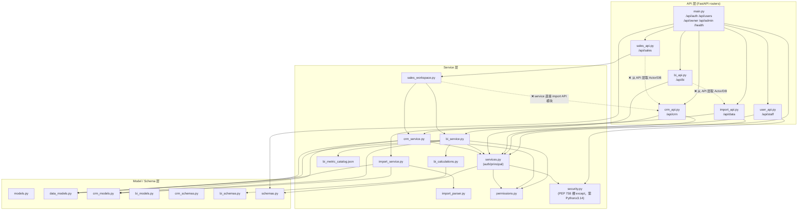

# 后端与架构主线 代码健康审计报告

- 项目：好客齐鲁经营管理平台（松茂经营管理平台）
- 审计范围：`apps/backend/app/**`（27 个 py）+ `apps/backend/alembic/versions/**`（8 个）+ `apps/worker/main.py`
- 审计性质：**只读**代码健康审计（不修改、不重构、不跑 migration/seed）
- 审计人：架构师 高见远（software-architect）
- 日期：2026-09-16
- 铁律遵守：仅创建/写入本报告文件；未改动任何源码、DB、migration。
- 修订 R1（2026-09-16）：经 team-lead 用两套解释器交叉验证，原 **TD-00「P0 语法错误致后端无法启动」为误报**——`except A, B:` 是 **Python 3.14 合法语法（PEP 758）**，而项目运行时契约即 3.14。该项已降级为 **P3**，并同步修正 §9.2、§10 的定级、计数与措辞。详见文末「修订说明」。
- 裁决记录（2026-09-16）：**TD-02（admin 可见性不一致）经 team-lead 裁决「保持 P1 且待业务决策」**——理由：(a) V1 现实暴露面为零，`admin` 不日常登录（`docs/05_页面与权限矩阵.md:267/269`）；(b) P0 定义要求「数据错误/安全事故/不可逆损失」，而此处是「策略自相矛盾 + 实现重复」；(c) **文档本身未定死 admin 能否读 CRM**（`docs/05` 三处口径互斥）。据此已在 TD-02 标注 `BLOCKED_BUSINESS_DECISION` 并给出分阶段处置。

---

## 1. 审计范围与方法

### 1.1 实际通读的文件（全文精读）

服务层：
`bi_service.py`(907)、`crm_service.py`(613)、`sales_workspace.py`(416)、`import_service.py`(395)、`import_parser.py`(450)、`services.py`(96)、`bi_calculations.py`(67)、`permissions.py`(31)、`security.py`(30)

API 层：
`main.py`(189)、`import_api.py`(342)、`crm_api.py`(255)、`bi_api.py`(102)、`user_api.py`(122)、`sales_api.py`(46)

模型/Schema/配置：
`data_models.py`(178)、`crm_models.py`(134)、`models.py`(71)、`bi_models.py`(42)、`crm_schemas.py`(270)、`bi_schemas.py`(283)、`schemas.py`(43)、`config.py`(46)、`db.py`(16)、`cli.py`(99)、`storage_init.py`(12)、`bi_metric_catalog.json`

工程外围：
`tests/conftest.py`、`tests/` 目录清单、`docker-compose.yml`、`.env.example`、`.gitignore`、`AGENTS.md`、`docs/05_页面与权限矩阵.md`、`scripts/*`（grep）

### 1.2 使用的命令/手段

| 手段 | 用途 |
|---|---|
| `Read` | 全文精读上列源码 |
| `Grep` | 角色/scope/时区/硬编码/引用检索 |
| `Glob` / `Bash ls|wc` | 文件清单与行数统计 |
| `python -m py_compile`（全量 ast 编译） | **语法级健康检查**（只读，不执行代码）。⚠️ 本机托管解释器为 **Python 3.13.12**，而项目运行时契约是 **3.14**（`pyproject.toml:8`、`apps/backend/Dockerfile:1`），凡跨版本结论一律以 3.14 为准 |
| `python` + `ast` 脚本 | 顶层符号引用计数、未使用 import 扫描 |
| `git log/status/ls-files` | 版本脱节度、`.env` 是否入库 |

### 1.3 全局背景确认

- `git log --oneline`：仅 7 个 commit（最新 `0c5ebbc`），而 `git status` 显示 **81 个已跟踪文件处于 modified 未提交** + 大量未跟踪新文件（`sales_api.py`、`sales_workspace.py`、`0006~0008` migration、`test_*.py`）。磁盘代码与 commit 严重脱节，本报告以**磁盘当前内容**为准。
- 项目由多个 AI 工具反复迭代，因此下文重点标注**同一逻辑多份实现**与**语义漂移**，而非代码风格。

---

## 2. 后端模块关系图（真实依赖，含跨层越界标注）

**越界点证据**

- `sales_workspace.py:12` `from app.crm_api import Actor, DB` —— service 层反向依赖 API 层。
- `bi_api.py:10` `from app.import_api import Actor, DB` —— API 之间互引（复用 DI 别名）。
- `sales_api.py:8` `from app.crm_api import Actor, DB`。
- `bi_service.py:15` 依赖 `bi_calculations`（合理）；`sales_workspace.py:11` 同时依赖 `bi_service` 与 `crm_service`（双服务耦合）。

**结论**：API 依赖别名（`Actor`/`DB`）在不同 router 文件里各自定义（`main.py:31/90`、`import_api.py:25/32`、`crm_api.py:15/22`），互相 import 形成环状耦合。应统一下沉到一个 `deps.py`。

---

## 3. 重复实现清单

> 优先级最高的维度。所有条目均给出位置与差异点。严重级定义见 §10 表头。

| 编号 | 重复内容 | 位置 A | 位置 B | 差异点 | 风险 | 建议方向 |
|---|---|---|---|---|---|---|
| D1 | 角色+数据范围（owner/manager/sales/finance/admin）判定 SQL，**同一规则 4 份实现** | `permissions.py:13-23` `can_read_owned`（语义口径，权威） | `bi_service.py:30-38` `scope`；`crm_service.py:84-93` `scope`；`import_api.py:235-246` `scoped_sales` | **admin 处理三处不同**：`crm_service.scope:85` `owner/admin → True`（admin 看全部）；`bi_service.scope:31` 把 admin 挡在 `require` 外→403；`import_api.scoped_sales:239-240` admin→显式 403。另 `permissions.can_read_owned` 明确“admin 无默认业务数据权限”。finance 非 custom 时三处均落到 `in_([])` | **P1**：admin 在 CRM 可见全部业务数据，在 BI/导入被拒，策略自相矛盾，易被误用为越权入口 | 抽出唯一 `apply_scope(query, principal, column)`；admin 策略写成显式常量；补跨模块一致性测试（AGENTS §6） |
| D2 | 客户“认养可见性”（claim 授权）逻辑 3 份 | `crm_service.py:63-66` `customer_scope` + `claimed_ids` | `bi_service.py:434-436`（workbench 内联 `or_(scope, Customer.id.in_(claimed))`）；`bi_service.py:672-675`（`_conversion_cycles` 内联 scope） | workbench 手写 `select(CustomerClaim.customer_id).where(user_id==uid)`，未复用 `claimed_ids` | **P2**：claim 口径若变更需改 3 处，漏改即数据不一致 | claim 可见性收敛为单一 helper，全部调用 |
| D3 | 待办时间窗（today/week/overdue/future/done）3 份 | `crm_service.py:488-500` `task_window` | `sales_workspace.py:207-213`（conditions 字典）；`bi_service.py:497-500`（workbench 内联 today/week/overdue） | crm：`datetime.combine(...,time.min,TZ)` 且 `week` 经 `start -= timedelta(days=start.weekday())` → **周一起**（`crm_service.py:494`）；bi：`week_start = today - today.weekday()` → **周一起**（`bi_service.py:498`）；**sales：`end=今天+1天`，week 窗口=[明天, 明天+7) → 明天起**（`sales_workspace.py:205/210`）。即 **crm 与 bi 一致，唯 sales_workspace 偏离** | **P1**：同一“本周待办”在销售端与其它端数字不同 | 统一到 `task_window`，明确“本周=周一起算”并加三端一致性测试 |
| D4 | 客户列表查询（pool/claim/q/level/tag 过滤）2 份且行为漂移 | `crm_service.py:127-161` `list_customers` | `sales_workspace.py:143-197` `customers` | crm 支持 `ownership` 过滤 + pool 时仍支持 `level`；sales 无 `ownership` 且 `pool=True` 时**丢弃** `level/tag_id`；pool 掩码 remark 条件不同（crm 仅非 owner/admin 掩码，sales 一律掩码） | **P2**：同一筛选条件两端结果不一致 | 以单一查询构造函数 + 显式能力参数实现 |
| D5 | 客户名规范化 `normalize_name` 3 份、**2 种语义** | `crm_service.py:164-165`（去空白+全角括号转半角） | `import_service.py:254` `''.join(r['name'].split())`（**不转括号**）；`crm_service.py:248`（内联复制） | 导入客户与 CRM 建客用不同规范化 → `duplicate_flags:169` 按 `normalized_name` 查重会**漏判**全角括号重名 | **P1**：重复客户漏检，污染认养/绑定去重 | 唯一 `normalize_name`，导入侧也调用；补重名边界测试 |
| D6 | BI 指标派生算法（环比/同比/占比/零除/月序列）在 4 个函数里各写一遍 | `bi_service.py:232-361` `analysis` | `bi_service.py:752-907` `overview`；`bi_service.py:622-701` `customer_analytics`；`sales_workspace.py:260-416` `performance` | 例：6 个月趋势循环 `for i in range(5,-1,-1)` 出现于 `bi_service.py:636-649`、`bi_service.py:825-831`；同比各写 `(a-b)/b*100`（`bi_service.py:286,288`、`overview:781`、`sales_workspace:318,355,391`），**只有部分**使用 `bi_calculations.ratio`；`share = x/total*100 quantize('0.1')` 重复 ≥6 处 | **P1**：口径漂移（AGENTS 铁律 3“指标口径唯一”）风险 | 抽出 `mom/yoy/share/trend_series` 纯函数，全部改调；指标字典对照测试 |
| D7 | “源销售核对 vs 已确认经营销售”两套口径分支反复内联 | `bi_service.py:214-229`（`order_value/included/normal_sale` 已存在） | `analysis:241-296`、`overview:760-783`、`workbench:408-431`、`attention:510-541`、`customer_analytics:583-604`、`sales_workspace:287-308` 各自重新 `review_ready` 并再判 verified | 每个函数独立决定 `verified`，`review_ready` 被反复调用（内含 `latest_fact` 查询） | **P1**：口径判定点分散，改一处漏一处 | 统一 `resolve_basis(db, src, …)` 返回 (verified, cfg, warning) |
| D8 | 分页返回结构重复定义 | `crm_schemas.py:221` `CustomerPage` | `bi_schemas.py:170` `OrderPage`、`:137` `AttentionPage`、`:157` `Team`；`sales_workspace.py:27/37/47` `Customers/Tasks/Recent` | 全是 `{rows,total}`；同时多数列表接口**裸 list 无 total** | **P2**：契约不统一 | 统一 `Page[T]` 泛型 + 全站 `{rows,total}` |
| D9 | `Person` DTO 2 份 | `bi_schemas.py:77`（id,name） | `crm_schemas.py:200`（id,display_name,username） | 同概念不同字段名（`name` vs `display_name`） | **P3** | 合并为一 |
| D10 | 指标 code/单位常量散落 | `bi_metric_catalog.json`（定义） | 各函数内字符串字面量（如 `bi_service.py:282-296`） | catalog 只存 definition/source，code 仍需手写字面量，无枚举 | **P3** | 生成 `MetricCode` 常量模块 |
| D11 | 数据源“可见范围”子查询 2 份 | `bi_service.py:126-127`（sources） | `bi_service.py:144-148`（source 单条校验） | 同义不同写法（distinct 子查询 vs `limit(1)`） | **P3** | 复用同一可见性子查询 |

---

## 4. API 一致性矩阵

| 模块 | 前缀 | 路由位置 | 分页风格 | 分页默认 | 列表返回 | 错误风格 | response_model 覆盖 | 不一致项 |
|---|---|---|---|---|---|---|---|---|
| main.py | `/api/auth`,`/api/users/{id}`,`/api/owner/status`,`/api/admin/status`,`/health` | 顶层散挂 | 无分页 | — | 单对象 | `HTTPException`→统一体 | ✅ 齐全（logout 204 除外） | 域划分混：用户端点散在 main，其余在 `user_api` |
| import_api.py | `/api/data` | router | `offset`/`limit` | 30/50/100 | **多为裸 list/dict**（手写 `str(Decimal)`） | 统一体 | ❌ **14 个端点无 response_model** | 与 AGENTS“强类型 DTO”冲突 |
| crm_api.py | `/api/crm` | router | `offset`/`limit` | 30/100 | `{rows,total}` 或裸 list | 统一体 | ✅ 全覆盖 | 裸 list 端点（followups/tasks/opportunities/tags）无 total |
| bi_api.py | `/api/bi` | router | `offset`/`limit` | 20 | `{rows,total}` | 统一体 | ✅ 全覆盖 | 与 CRM 默认 limit 不同 |
| user_api.py | `/api/staff` | router | 无 | — | list | 统一体 | ✅ | 文件名 `user_api` 与路径 `/api/staff` 不符 |
| sales_api.py | `/api/sales` | router | `offset`/`limit` | 20 | `{rows,total}` | 统一体 | ✅（response_model 指向 `sales_workspace` 定义类） | 与 CRM 同资源分页默认不同 |

**分页不一致证据（无 `page/page_size`，全为 `offset/limit`，默认值散布）**
- `import_api.py:186` limit 默认 30（1–100）；`:226` 50；`main`-挂载无。
- `crm_api.py:51` limit 默认 30；`:81/89/98` 固定 `limit(100)` 无 limit 参数。
- `bi_api.py:74` 默认 20；`sales_api.py:27` 默认 20。
- 返回形状：`crm_api.py:80-85` 返回裸 list（无 total）；`import_api.py:249-263` 返回裸 dict。

**无 `response_model` 端点清单（证据：`import_api.py`）**
`:106 sources`、`:114 create_source`、`:130 mapping_users`、`:137 staff_config`、`:152 purge_source_data`、`:209 discard_batch`、`:217 original`、`:225 raw_rows`、`:249 sales_monthly`、`:266 orders`、`:277 order_detail`、`:289 periods`、`:300 close_period`、`:319 finance_monthly`。
其中多处**手工把 `Decimal` 转字符串**（`import_api.py:333`、`:262`、`:282`），与其它模块由 Pydantic 序列化不一致。**违反 AGENTS §4“强类型 DTO”与铁律 9 精神（契约不统一）。严重级 P2。**

**错误结构：整体统一（正面）**
- `main.py:35-45` 定义唯一错误体 `{error:{code,message,request_id}}`；`main.py:76-83` 对 `StarletteHTTPException`、`RequestValidationError` 统一处理；`main.py:48-73` 中间件兜底 500。**无模块自造错误体**，AGENTS“统一错误结构”基本达成。

**403/404 策略偏差（AGENTS §6 要求一致）**

| 场景 | 处理 | 位置 | 是否一致 |
|---|---|---|---|
| 资源不存在/越权读取 | 404 | `bi_service.py:84/87/143/148`、`crm_service.py:100`、`import_api.py:281` | 一致（主流） |
| 角色不足 | 403 | `bi_service.py:27`、`crm_service.py:43`、`import_service.py:28` | 一致 |
| 系统 admin 读经营数据 | BI/导入 403，CRM 放行 | `import_api.py:239-240` vs `crm_service.py:85` | ❌ 不一致（见 D1） |
| 财务读非财务批次 | 404 | `import_service.py:54-57` | 与上条“角色不足 403”口径不同 |
| 负责人不可分配 | 422 | `crm_service.py:121/123` | 与“越权 403/404”口径不同 |

**其它不一致**
- 健康检查：`main.py:93` `/health`（无 `/api` 前缀），且 `main.py:97` 硬编码版本串 `"0008_v11"`。
- 日期范围参数命名不统一：`ReviewInput.coverage_from/to`（`bi_schemas.py:46-47`）、`import_api.py:250` `date_from/date_to`、`sales_api.py:20` `from/to`（alias）。

---

## 5. 硬编码清单

> 铁律 9“配置不写死”。`AGENTS.md:15` 明确 URL/路径/密码/Secret/企业 ID 走配置。

| 位置 | 硬编码内容 | 违反铁律9 | 建议落点 |
|---|---|---|---|
| `bi_service.py:22`、`crm_service.py:16`、`import_parser.py:66`、`import_api.py:263` | 时区 `'Asia/Shanghai'`（4 处） | **是** | 已存在 `config.py:12 app_timezone`，应统一读取 `get_settings().app_timezone` |
| `main.py:97` | DB 版本号 `"0008_v11"` | 是 | 读 `alembic_version` 表或配置 `REQUIRED_SCHEMA_REVISION` |
| `schemas.py:43` | `milestone: str = "M3"`（已进 M4/V1.1） | 是 | 版本常量模块 |
| `bi_service.py:466` / `:480` | “7 天未跟进”阈值 `timedelta(days=7)` + 文案 | **是** | 并入 `Settings`（`followup_days` 已有类似机制） |
| `bi_service.py:294` | 前 20% 客户 `len(customers)/5` | 是 | 指标参数（`Settings`） |
| `bi_service.py:293/661/874/898/903` | Top5 / Top20 / Top5商品 / Top4 / Top5 客户 | 是 | 指标参数 |
| `bi_service.py:565-575` | `RFM_SEGMENTS` 分层名、`CONVERT_BUCKETS` 转化周期桶 | 是（桶不可配） | DB 配置表/常量模块 |
| `import_parser.py:16/18-20` | `VERSION="m1-template-1"`、`MAX_ROWS/COLS/CELLS` | 是 | 配置 |
| `import_parser.py:174-185/348-358` | 表头别名、必填列、利润/资产负债表行次映射（精斗云模板） | 是（模板耦合） | 模板配置化 |
| `crm_service.py:19-21` | `DEFAULT_TAGS` 预设标签 | 是 | DB 配置/常量 |
| `crm_service.py:151-154`、`sales_workspace.py:165` | 等级集合 `{'A','B','C','D'}` | 是 | 常量模块 |
| 全局多文件 | 状态串 `'public_pool'/'owned'/'unassigned'/'todo'/'done'/'won'/'open'`、角色串 `'sales'…` | 是 | 枚举/常量模块 |
| `cli.py:49-55` | `demo_*` 账号名（仅演示，prod 有闸门 `cli.py:44`） | 否（可接受） | 保留 |
| `import_api.py:166-167`、`config.py:25` | 上传 MIME 白名单/大小 | 否（config 已收敛 `import_max_bytes`） | 保留 |

**说明（正面）**：数据库/密钥已用 `SecretStr`（`config.py:16-17`）、`db.py:11 hide_parameters=True`、生产 HTTPS/文档开关（`config.py:37`、`main.py:27-29`）。**但时区硬编码与 `app_timezone` 配置并存**是最典型的“配置不写死”自相矛盾。

---

## 6. 疑似废弃代码清单

> 用 `python ast` 顶层符号引用计数 + 全仓 grep 判定。

| 符号/资产 | 位置 | 引用数 | 判定依据 | 处置建议 |
|---|---|---|---|---|
| `actual_cost_amount`（列） | `data_models.py:148`、migration `0002:179` | 定义 2，**写入 0** | 全仓无任何 `obj.actual_cost_amount = …`；成本/毛利按行计算未实现 | 保留列（数据只增不删），标注未实现；上线前明确是否纳入 ROI |
| `scope_type='all'` | `models.py:37`、`cli.py:53`（demo_owner） | 定义 + 1 demo | **无任何 scope 函数读取 `'all'`**；owner 靠 `role_code` 判定 | 文档化或删除该枚举值，避免误导 |
| `bi_calculations.py` | 67 行 | **被引用** | `bi_service.py:15` 导入其 `ZERO/money/ratio/target_metrics/work_dates…`；`sales_workspace.py:264+` 经 `bi.*` 调用 | **未废弃**——与任务假设相反，保留（但见 D6：部分算法绕开它） |
| `import_purge` 生产代码 | `import_service.py:362-395`、`import_api.py:152-159` | **被引用+被测试** | 路由暴露 + `tests/test_import_purge.py:76` 断言审计 | **未废弃**——与任务假设相反，保留 |
| `crm_schemas.Event/OrderSummary/ProductSummary/SalesSummary` | `crm_schemas.py:206/214/259/264` | 各 2（定义+ `CustomerDetail` 引用） | 由 `CustomerDetail` 使用 | 保留 |
| `bi_schemas.Person` vs `crm_schemas.Person` | `bi_schemas.py:77` / `crm_schemas.py:200` | 各被引用 | 概念重复 | 合并（见 D9） |
| `StatusView.milestone` | `schemas.py:43` | 引用 | 值过期（M3） | 更新或删除 |
| 未使用 import | 全 `app/**` | 扫描 **0 条** | ast 扫描无未使用导入 | 无需处理（正面） |

**结论**：任务假设的两个“疑似废弃”对象（`bi_calculations`、`import_purge`）经核实**均在使用**；真正未接线的是 `actual_cost_amount` 列与 `scope_type='all'` 枚举值。

---

## 7. 权限实现对照表

| 权限点 | 实现文件:行 | 是否重复 | 是否一致 | 越权风险 |
|---|---|---|---|---|
| 业务归属读权限（owner/sales/manager/finance） | `permissions.py:13-23` | 是三处 SQL 复刻：`bi_service.py:30-38`、`crm_service.py:84-93`、`import_api.py:235-246` | 语义近似但 admin 分支不一致 | **中**：见下 |
| admin 业务数据可见性 | `crm_service.py:46-47`（`owns` 返回 True）、`:85`（scope 返回 True） | 与 `import_api.py:239-240`(403)、`bi_service.py:31`(403) 冲突 | ❌ 不一致 | **中**：admin 在 CRM 可读全部客户/跟进；文档 `docs/05 §5.5` 与 `permissions.py:14` 均称“admin 无默认业务数据权限” |
| 认养客户可见性 | `crm_service.py:56-66` | 是（另见 `bi_service.py:434-436/672-675`） | 近似 | 低 |
| 目标设置权限（仅 owner/manager） | `bi_service.py:101`、`bi_api.py:66` | 否 | 一致 | 低 |
| 财务期间确认 | `import_api.py:302`（仅 admin/owner） | 否 | 一致 | 低 |
| 客户新增/公海治理 | `crm_service.py:177/194/217/234/255/321/341` | 否 | 一致 | 低 |
| 前端传参决定可见范围 | 未发现（`sales_workspace.py:261` 明确“身份取自登录 actor，绝不取 query”） | — | ✅ 合规 | 无（正面，满足 AGENTS §5/铁律 5） |
| `detail` 端点角色门 | `crm_api.py:117-119` 仅需登录，无角色 gate | — | 依赖 service 内 `owns` | **中**：叠加 admin=全量，见上 |

**核心结论**：权限**判定规则本身被复制为 4 份 SQL**，且 **admin 策略在 CRM 与 BI/导入之间相反**。这是本项目最需要治理的权限债（P1）。正面：未发现“前端隐藏按钮=权限”或“依赖 query 决定数据范围”的违规。

---

## 8. Migration 问题清单

| 编号 | 问题 | 证据 | 严重级 |
|---|---|---|---|
| M1 | 文件名里程碑前缀重复 | `0001_m0_m0_system_users…`、`0002_m1_m1_sources…`（`ls versions`）——Alembic 自动 slug 产生 `m0_m0` | P3 |
| M2 | revision 命名与里程碑脱节 | `0006_m5_multi_claim_pool.py:6`（公海/多认养实为 **M2** CRM 功能却命名 `m5`）；`0007_quarterly_target.py:4` 也叫 `0007_m5`（两个不同特性共用一个 `m5`）；`0008_sales_v11.py:4` `revision='0008_v11'` 脱离 M0–M5 体系 | P2 |
| M3 | down_revision 链**完整**、无重复 revision | `0001_m0(None)→0002_m1→0003_m2→0004_m2→0005_m3→0006_m5→0007_m5→0008_v11`（`Grep ^revision/down_revision`） | ✅ 无问题 |
| M4 | 降级安全性不一致 | `0008` 用 `DROP COLUMN IF EXISTS`（`:19-20`）而 `0007:23`/`:20` 用裸 `DROP`（无 IF EXISTS）；`0006:19-20` 用 `CREATE INDEX`（非 `op.create_index`，无 IF NOT EXISTS） | P3 |
| M5 | 破坏性数据迁移 + 尽力回滚 | `0006:23-29` 把全部非 CRM 客户回填 `ownership_status='public_pool'`，`downgrade:37-42` 为“best-effort 逆向”，语义不可完全还原 | P2（需显式备份前置） |
| M6 | 依赖 DB 自动命名约束 | `0005:22` 匿名 `UniqueConstraint(user_id,period_month)` → DB 自动名 `sales_target_user_id_period_month_key`，`0007:13` 按此名 drop | P3 |
| M7 | 健康检查与服务端版本串耦合 | `main.py:97` 硬编码 `"0008_v11"`；改 revision 名即 503 | P2 |

---

## 9. 性能与安全问题清单

### 9.1 性能（多数集中在 BI/分析路径）

| 编号 | 问题 | 证据 | 严重级 |
|---|---|---|---|
| P-a | 全表加载 + Python 聚合 | `bi_service.py:206-211 load_orders` 把某源**全部**订单读入内存，`analysis` 未按日期下推过滤（`:240`）；`overview:759`、`attention:508`、`workbench:416`、`customer_analytics:585` 复用同模式 | P1 |
| P-b | 重复全量加载（6 次） | `sales_workspace.py:128-135` 循环 6 个月，每次调 `bi.analysis(...)` → 6× 全量订单 + 6× `review_ready`（内含 `latest_fact` 查询） | P1 |
| P-c | 同一请求重复加载 | `overview:759` 载入 `rows`，又在 `:896` 调 `attention()`（`attention:508` 再 `load_orders`） | P2 |
| P-d | 循环内查库（N+1） | `bi_service.py:887-891` 每位人员一次 `SalesTarget` 查询；`sales_workspace.py:311-315` 逐月 `get_target`；`crm_service.py:196-211` 每条池导入 2 次查重；`crm_service.py:313-314`/`:330-334` 批量分配/认养逐行 `transfer` | P1 |
| P-e | 缺索引的过滤字段 | `Customer.normalized_name`（`data_models.py:81` 无索引，却按等值查重 `crm_service.py:169`）；`activity_log.object_id`（`models.py:69` 无索引，`crm_service.py:584` 过滤） | P2 |
| P-f | 无分页/整表排序 | `bi_service.py:558` 结果排序后切片分页；`crm_api.py:81/89/98` 固定 `limit(100)` 无分页游标 | P3 |

### 9.2 安全

| 编号 | 问题 | 证据 | 严重级 |
|---|---|---|---|
| S0 | `security.py` 采用 **Python 3.14 专有语法（PEP 758 无括号 `except`）**，外观酷似 Python 2 残留；在 **<3.14 解释器**上硬失败 | `security.py:23` `except VerificationError, InvalidHashError:`（**全仓唯一 1 处**）。项目运行时 3.14.3：`py_compile` rc=0、`compile(...)`=OK；同一文件在托管 3.13.12 → `SyntaxError: multiple exception types must be parenthesized`。契约：`pyproject.toml:8 target-version="py314"`、`apps/backend/Dockerfile:1 FROM python:3.14-slim` | **P3**（运行时正常；仅在低版本工具链/误改风险） |
| S1 | 语义本身正确（**无需修改**） | 3.14 下裸形式 `except A, B:` 等价于 `except (A, B)`，`VerificationError` 与 `InvalidHashError` 均被捕获；仅当需兼容 <3.14 时才补括号 | P3 |
| S2 | CSRF/CORS 依赖 Origin，缺 Origin 的非浏览器 POST 被 403 | `main.py:51-52` 非 GET/HEAD/OPTIONS 且 `Origin` 不在白名单→403；脚本/集成方无 Origin 时会被拒 | P2 |
| S3 | Cookie 安全属性 | `main.py:115-123` `httponly=True, samesite='lax', secure=仅生产` —— 合理；生产强制 HTTPS（`config.py:37`） | ✅（正面） |
| S4 | 生产关闭 debug/docs | `main.py:26-29`，`config.py:37` | ✅（正面） |
| S5 | 密钥/连接串不入库、不日志 | `.env` 未跟踪（`git ls-files` 仅 `.env.example`）；`db.py:11 hide_parameters`；`main.py:63-72` 只记 method/status/request_id；`cli.py:95` 不打印凭据 | ✅（正面） |
| S6 | 上传安全（路径穿越/类型/大小） | `import_api.py:101-105` 校验文件名（禁 `/\`、`\x00`、换行，白名单后缀）；`import_service.py:44-48 stored_file` 用 `is_relative_to(root)`；`import_service.py:112-114` 用 `'xb'` 独占写 | ✅（正面） |
| S7 | 未发现 SQL 拼接 | 全量 grep `text(f|execute(f|.format` 仅命中 `main.py:21` 日志格式；migration 内 f-string 仅拼接**硬编码表名** | ✅（正面） |
| S8 | demo 账号生产闸门 | `cli.py:44-45` 生产环境 `seed_demo` 抛错；`docker-compose.yml:41` 只 `bootstrap-admin`，无自动 seed | ✅（正面） |
| S9 | 脆弱点 | `bi_service.py:819` `finance_periods.get(period).is_closed`——若 `period` 无对应 `FinancialPeriod` 行则 `None.is_closed` 抛 `AttributeError`（当前被 `if profit` 间接保护，但属脆弱耦合） | P2 |

**自查（依赖运行时/版本判断的结论复核）**：本报告原仅 **S0/S1/TD-00** 依赖解释器版本判断，已全部按 3.14 契约修正。其余条目均基于**静态代码语义/引用关系/文件行号**，不依赖 Python 版本、第三方库版本或 Docker 镜像版本；未发现同类偏差。`docker-compose.yml` 中的 `postgres:18.4-bookworm`、`caddy:2.10.2-alpine`、`python:3.14-slim` 仅作为事实引用，无兼容性断言。

---

## 10. 后端技术债条目表

> 严重级：**P0=会造成数据错误或不安全；P1=阻碍后续开发或有明确缺陷；P2=明显维护负担；P3=整洁度问题。**

| 编号 | 标题 | 证据（文件:行） | 严重级 | 影响面 | 建议处置（分阶段/可回滚/带测试） | 前置依赖 |
|---|---|---|---|---|---|---|
| TD-00 | `security.py` 采用 Python 3.14 专有语法（PEP 758 无括号 `except`），外观酷似 Python 2 残留，易误导；<3.14 环境（本机托管 3.13.12、部分 CI/IDE/linter）直接硬失败 | `security.py:23` `except VerificationError, InvalidHashError:`（全仓唯一 1 处）。运行时 3.14.3 venv `py_compile` **rc=0**、`compile(...)`=OK；同文件在 3.13.12 → `SyntaxError: multiple exception types must be parenthesized`。契约：`pyproject.toml:8 target-version="py314"`、`apps/backend/Dockerfile:1 FROM python:3.14-slim` | **P3** | 仅低版本工具链/文档歧义；运行时（3.14）正常 | 阶段1：保留写法并加注释 `# PEP 758, requires Python>=3.14`；阶段2：CI 固定 3.14 解释器，避免 3.13 误报/误改；附 `verify_password` 单测（两种异常均返回 False） | 无 |
| TD-01 | 权限范围判定 4 份实现、admin 策略互斥 | `permissions.py:13-23`、`bi_service.py:30-38`、`crm_service.py:84-93`、`import_api.py:235-246` | **P1** | 全站数据权限 | 阶段1：定义唯一 `apply_scope()` 并对 4 处做**等价性测试**（含 admin 期望值），先不改行为；阶段2：切流到唯一实现并删除副本；阶段3：删旧函数 | 无 |
| TD-02 | admin 在 CRM 全量可见 vs BI/导入 403；**根因是文档未定死 admin 口径** | **代码两侧**：CRM 侧 `crm_service.py:46-47`（`owns` → admin 为 True）+ `crm_service.py:85`（`scope` → admin `return True`）对阵 BI/导入侧 `import_api.py:239-240`（admin → 403）+ `bi_service.py:31`（`require` 不含 admin → 403）。**无角色 gate 的入口**：`crm_api.py:117-119` customer detail 仅需登录，完全依赖 `owns()` → **任意 admin 会话（含 `demo_admin`）可读任意客户 360（联系人/跟进/商机/认领）**，而同一 admin 在 `/api/bi`、`/api/data` 被 403。**根因（文档口径互斥）**：`docs/05_页面与权限矩阵.md:16`（admin「业务数据默认只为运维需要」）、`:211-231`（权限矩阵把 admin 对客户列表/CRM 扩展/联系人/跟进/待办/商机/商品订单标「运维R」）、`:241`（§5.5「UI 可按需要限制」）三处互不相同，且与 `permissions.py:14` docstring「no implicit business access」冲突——**代码只是把这个矛盾复制成了两种实现，不是某一侧明确违规** | **P1**（保持，team-lead 裁决） | V1 暴露面：admin 不日常登录（`docs/05:267-269`）→ 当前非事故；但**一旦为外部 IT/实施方开 admin 账号做运维，即构成实质性越权读取面**。属「策略自相矛盾 + 实现重复」，非 P0 | **⚠️ `BLOCKED_BUSINESS_DECISION`（AGENTS §2：不偷偷发明规则）**。阶段1（不改行为）：加参数化测试，把 4 处对不同角色的**实际结果固化为快照**；阶段2：把 admin 策略提为**显式配置项/常量**（如 `ADMIN_BUSINESS_ACCESS = "deny"` \| `"read"`）；阶段3：老板拍板后统一 4 处并删除副本，同步修订 `docs/05` | TD-01 |
| TD-03 | 客户名规范化 2 语义、3 副本，查重漏判 | `crm_service.py:164-165/248`、`import_service.py:254` | **P1** | 数据质量/去重 | 唯一化 + 加“全角括号重名”回归测试；历史数据只读比对，不批量回改 | 无 |
| TD-04 | BI 指标算法在 4 个函数重复、口径漂移 | `bi_service.py:232-361/622-701/752-907`、`sales_workspace.py:260-416` | **P1** | 指标正确性（铁律3） | 抽 `mom/yoy/share/trend/basis` 纯函数；以指标字典样本测试锁定现值后再替换 | 无 |
| TD-05 | “本周”口径不一致：**sales_workspace「明天起」vs crm_service/bi_service「周一起」** | `sales_workspace.py:205/210`（`end = start + 1天`，week=[明天, 明天+7)）对阵 `crm_service.py:493-494`（`start -= timedelta(days=start.weekday())` → 周一）与 `bi_service.py:498-499`（`week_start = today - today.weekday()` → 周一） | **P1** | 待办口径 | 先统一为“周一起算”并加三端一致性测试；再收敛实现 | 无 |
| TD-06 | 全量加载 + 6 次重复聚合 | `bi_service.py:206-211/240`、`sales_workspace.py:128-135` | **P1** | BI 性能 | 阶段1：`monthly_trend` 改为单次聚合；阶段2：查询层下推日期范围 + `GROUP BY` | 无 |
| TD-07 | N+1 查询（目标/查重/批量） | `bi_service.py:887-891`、`sales_workspace.py:311-315`、`crm_service.py:196-211/313-314/330-334` | **P1** | 性能 | 逐个替换为批量预取/JOIN；每处配 query-count 断言测试 | 无 |
| TD-08 | import_api 14 端点无 response_model、手工 `str(Decimal)` | `import_api.py:106/114/130/137/152/209/217/225/249/266/277/289/300/319/333` | **P2** | 契约/前端类型 | 阶段1：补 response_model（先 `dict[str,Any]` 占位不改行为）；阶段2：改强类型 DTO | 无 |
| TD-09 | 分页契约不统一 + limit 默认值散布 | `crm_schemas.py:221`、`bi_schemas.py:137/157/170`、`sales_workspace.py:27/37/47`、默认值见 §4 | **P2** | 前端/契约 | 统一 `Page[T]` + 统一默认（建议 20/50）；保留兼容字段 | 无 |
| TD-10 | 时区硬编码 4 处与 `app_timezone` 并存 | `bi_service.py:22`、`crm_service.py:16`、`import_parser.py:66`、`import_api.py:263` | **P2** | 一致性 | 统一读 `settings.app_timezone`；加时区单测 | 无 |
| TD-11 | 健康检查硬编码 DB 版本 | `main.py:97` | **P2** | 部署健壮性 | 改为配置/查表比较 | TD-23 |
| TD-12 | 业务阈值/桶/RFM 段/Top-N 硬编码 | `bi_service.py:293/294/466/480/565-575/661/874/898/903` | **P2** | 可配置性（铁律9） | 迁入 `Settings`/配置表；补边界测试 | 无 |
| TD-13 | 客户列表两套实现行为漂移 | `crm_service.py:127-161` vs `sales_workspace.py:143-197` | **P2** | CRM 一致 | 抽查询构造器；两端共享；补筛选矩阵测试 | 无 |
| TD-14 | claim 可见性 3 副本 | `crm_service.py:63-66`、`bi_service.py:434-436/672-675` | **P2** | 权限一致 | 收敛为单 helper | TD-01 |
| TD-15 | 脆弱 `.get(period).is_closed` | `bi_service.py:819` | **P2** | 财务页 500 风险 | 显式判空 + 单测 | 无 |
| TD-16 | service 反向依赖 API（`Actor/DB` 别名互引） | `sales_workspace.py:12`、`bi_api.py:10`、`sales_api.py:8` | **P2** | 架构/可测 | 抽 `app/deps.py`，统一 `Actor/DB/Current`；消除 API↔service 环 | 无 |
| TD-17 | migration 命名与里程碑脱节、破坏性回填 | `0006:6/23-29`、`0007:4`、`0008:4` | **P2** | 可追溯性 | 只改**后续**命名规范；旧文件加注释说明；破坏性迁移标注“需备份前置” | — |
| TD-18 | 未接线列 `actual_cost_amount`、装饰性 `scope_type='all'` | `data_models.py:148`、`models.py:37`、`cli.py:53` | **P2** | 语义澄清 | 文档标注/实现二选一；不删列 | — |
| TD-19 | 全局状态/角色字符串无常量模块 | 多文件（见 §5） | **P3** | 可维护 | 引入枚举/常量模块，逐步替换 | 无 |
| TD-20 | `schemas.py:43 milestone="M3"` 过期 | 同上 | **P3** | 整洁 | 更新或删除 | — |
| TD-21 | `Person` 双定义、`metric code` 字面量散落 | `bi_schemas.py:77`、`crm_schemas.py:200`、各 metric 调用 | **P3** | 整洁 | 合并 + 生成常量 | 无 |
| TD-22 | migration 降级安全不一致 | `0007:20/23`、`0008:19-20`、`0006:19-20` | **P3** | 整洁 | 统一 `IF EXISTS`/`op.create_index` 风格 | — |
| TD-23 | 版本串耦合健康检查（与 TD-11 同源） | `main.py:97` | **P3** | 整洁 | 见 TD-11 | — |

### 严重级分布（修订后口径）

- **P0：0 条**（原 TD-00 经两套解释器交叉复核为**误报**，已降级——见 S0/TD-00；按 P0 定义「会造成数据错误或不安全」重新核对，无第二条被过度定级）
- **P1：7 条**（TD-01 权限四份实现、TD-02 admin 策略冲突、TD-03 客户名规范化、TD-04 指标算法重复、TD-05 本周口径、TD-06 全量重算、TD-07 N+1）—— 注：TD-01 与 TD-02 同源
- **P2：11 条**（TD-08 ~ TD-18）
- **P3：6 条**（TD-00、TD-19 ~ TD-23）
- 合计 24 条 TD 条目

### 最严重的 3 项（修订后）

1. **TD-01 / TD-02（P1）**：数据范围判定被复制成 4 份 SQL，且 admin 可见性在 CRM 与 BI/导入**完全相反**，直接冲击 AGENTS 铁律 5/§6 与 `docs/05 §5.5`。
2. **TD-03（P1）**：客户名规范化存在 2 种语义、3 处副本，导致导入侧与 CRM 侧重名查重**漏判**（数据质量）。
3. **TD-04 / TD-06 / TD-07（P1）**：BI 指标算法在 4 个函数重复实现、口径漂移，叠加「全表加载 + 6 次重算 + N+1」，威胁「指标口径唯一」（铁律 3）并造成性能负担。

（原 TD-00 已复核为误报，降级 P3，不再入选。）

---

## 附：审计中确认的“健康面”（避免过度悲观）

1. 错误结构在全站**已统一**（`main.py:35-45/76-83`），无模块自造错误体。
2. **零**未使用 import（ast 扫描）；`bi_calculations`、`import_purge` 均在用。
3. 上传安全（文件名/类型/大小/路径穿越/独占写）、密钥管理、生产 debug/docs 关闭、demo 账号生产闸门 **均已到位**。
4. 未发现 SQL 字符串拼接注入面。
5. 未发现“前端隐藏按钮当权限”或“query 参数决定数据范围”的越权模式。
6. Alembic `down_revision` 链**完整无重复**，从 `0001_m0` 到 `0008_v11` 连续。

---

## 修订说明（R1，2026-09-16）

| 项 | 修订前 | 修订后 | 依据 |
|---|---|---|---|
| TD-00 定级 | **P0**「后端无法导入启动，全站崩」 | **P3**「Python 3.14 专有语法，<3.14 环境硬失败、外观类 Py2 易误导」 | team-lead 两套解释器交叉验证 + 本报告复核项目契约 |
| §9.2 S0 | P0（致命） | P3 | 同上 |
| §9.2 S1 | P0（修复要求） | P3（语义正确，无需修改） | 3.14 下裸 `except A, B:` ≡ `(A, B)` |
| P0 计数 | 1 | **0** | — |
| P1 / P2 / P3 计数 | 6 / 12 / 4 | **7 / 11 / 6** | 按 TD 表逐行重数（含 TD-00 迁入 P3），修正原稿计数笔误 |
| 「最严重 3 项」 | 含 TD-00 | 移除 TD-00，改列 TD-01/02、TD-03、TD-04/06/07 | — |
| TD-02 定级 | 待 team-lead 交叉验证 | **保持 P1 + 标注 `BLOCKED_BUSINESS_DECISION`** | team-lead 裁决：V1 admin 不日常登录（暴露面为零）、P0 定义不含「可逆的策略矛盾」、且 `docs/05` 三处口径互斥无权威结论；已补代码两侧行号证据与三阶段处置 |
| D3 / TD-05 描述纠正 | 误称「crm/sales 从今天起、bi 从周一起」 | 更正为「**sales_workspace 明天起 vs crm_service/bi_service 周一起**」 | 与 QA 独立复核一致：`crm_service.py:493-494` 实为周一起（`start -= timedelta(days=start.weekday())`），`bi_service.py:498` 同；仅 `sales_workspace.py:205/210` 用 `end=今天+1天` 偏离 |

**误报根因（方法学反思）**：本报告初次语法检查使用环境默认的托管解释器 **Python 3.13.12**，而项目运行时契约是 **Python 3.14**（`pyproject.toml:8 target-version="py314"`、`apps/backend/Dockerfile:1 FROM python:3.14-slim`）。`except A, B:` 无括号写法因 **PEP 758** 在 3.14 起合法，故 3.13 下的 `SyntaxError` 不能代表项目实际运行状态。**结论：凡“语法/运行时”判断，必须先确认并锁定项目声明的解释器版本，再据以判定。**

**证据（两侧对比）**

- 项目运行时 **Python 3.14.3**（`.venv/Scripts/python.exe`，`sys.version` → `3.14.3`）：`python -m py_compile apps/backend/app/security.py` → **rc=0，无输出**；`compile(...)` → OK。
- 环境托管 **Python 3.13.12**：同一文件 → `SyntaxError: multiple exception types must be parenthesized`（rc=1）。
- 全仓此类写法**仅 1 处**：`apps/backend/app/security.py:23`。

**对 P1「admin 可见性相反」的证据补充确认**（team-lead 将交叉验证）：报告已给出**两侧 `文件:行号` 原文证据**——CRM 侧 `crm_service.py:46-47`（`owns` 返回 `actor.role_code == 'admin' or …`）与 `crm_service.py:85`（`scope` 中 `if actor.role_code in {'owner','admin'}: return True`）；BI/导入侧 `import_api.py:239-240`（admin → 显式 `raise HTTPException(403,…)`）与 `bi_service.py:31`（`require(actor, {'owner','manager','sales','finance'})` 不含 admin → 403）。另见 §3 D1、§7「admin 业务数据可见性」行。
