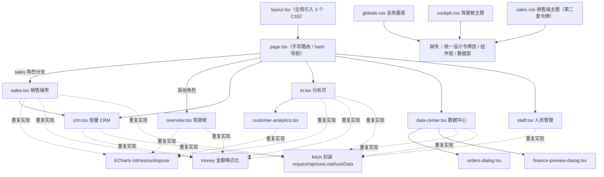

# 前端代码健康审计报告（02_frontend）

- 项目：好客齐鲁经营管理平台（松茂经营管理平台）
- 审计对象：`apps/frontend/`（Next.js 16 App Router + React 19 + TS 7 + 原生 CSS + ECharts 6 + Playwright）
- 审计角色：软件工程师（寇豆码）
- 审计性质：**只读静态审计**（未运行 build/install/playwright，未修改任何源码）
- 证据约定：所有结论标注 `文件路径:行号`；无法直接证实的标注「待核实」
- 严重级别：P0 功能错误/线上问题；P1 阻碍后续开发或明确缺陷；P2 明显维护负担；P3 整洁度

---

## 1. 审计范围与方法

### 1.1 范围

| 类别 | 文件 | 说明 |
|---|---|---|
| 页面/容器 | `app/page.tsx`、`app/sales.tsx`、`app/crm.tsx`、`app/bi.tsx`、`app/overview.tsx`、`app/data-center.tsx`、`app/staff.tsx`、`app/customer-analytics.tsx` | 8 个 |
| 弹窗/局部组件 | `app/orders-dialog.tsx`、`app/finance-preview-dialog.tsx`、`app/login-illustration.tsx` | 3 个 |
| 布局/类型 | `app/layout.tsx`、`app/crm-navigation.ts` | 2 个 |
| 样式 | `app/globals.css`、`app/cockpit.css`、`app/sales.css` | 3 个 |
| 配置 | `next.config.ts`、`tsconfig.json`、`playwright.config.ts`、`package.json` | 4 个 |
| 测试护栏 | `e2e/*.spec.ts`（9 个） | 仅作为回滚护栏参考，未运行 |
| 对照物 | `DESIGN.md`（设计契约）、`apps/backend/app/crm_schemas.py`、`apps/backend/app/bi_schemas.py` | 仅用于字段漂移比对 |

### 1.2 方法

1. 全量 Read 16 个源码文件 + 3 个 CSS + 4 个配置。
2. Grep/Glob 做交叉检索：函数定义重复、类名引用、`!important`、hex 颜色、ECharts 生命周期、`<dialog>`、`role="alert|status"`。
3. Bash（`awk`/`grep -o`/`wc`）做定量统计：超长行定位、颜色频次、死类名判定、丢弃依赖核对。
4. 与 `DESIGN.md` 契约、后端 Pydantic schema 做字段级比对。
5. 未修改任何业务代码；唯一写入为本报告。

### 1.3 关键背景

- 磁盘代码与 git 严重脱节：`git status --porcelain` 共 **81** 项变更未提交，历史仅 **7** 个 commit。
- 项目经历至少 4 轮 AI 驱动的 UI 改版（森林绿 → 蓝白 SaaS → 驾驶舱 → 销售端 4 页 → 登录页），本报告重点即是这些改版留下的重复/废弃/耦合痕迹。
- **无 `components/`、无 `lib/`、无 `hooks/` 目录**：全部 UI 与逻辑堆在页面文件里（`find app -type f` 仅 16 个平铺文件）。

---

## 2. 前端目录与页面结构

### 2.1 结构事实

- 只有一个路由入口 `app/page.tsx`（`"use client"`），它是**事实上的路由器**：用 `useState(view)` + `location.hash` 手写导航（`page.tsx:23,35-54,157-180`），不存在 Next App Router 的嵌套路由/并行路由。
- 会话分叉点：`page.tsx:156` 若 `role_code === "sales"` 直接渲染 `SalesWorkspace`，销售端是**独立壳**（自己的侧栏/顶栏/图表/主题），与其余角色共用同一个 `layout.tsx`。
- 三个 CSS 文件在 `layout.tsx:2-4` **全局无条件引入**，即 `sales.css`（26.8KB，销售端专用）也会加载到登录页/驾驶舱/CRM 等所有页面。

### 2.2 页面 → 样式 → API 关系（标注缺失抽象层）

**缺失的抽象层（图示虚线部分）**：
1. 缺 `components/ui/*`（Dialog/Card/KpiCard/Empty/Loading/ErrorState/Pager/Table/Tabs/Tag/Button）→ 各页各写一套（见第 4 节）。
2. 缺 `lib/api.ts`（统一 fetch 封装与错误约定）→ 4 套封装（见第 5 节）。
3. 缺 `lib/format.ts`（金额/日期/百分比/紧凑金额）→ 8 份 `money`（见第 5 节）。
4. 缺 `lib/types.ts`（业务实体类型）→ 同一实体多处声明且与后端漂移（见第 8 节）。
5. 缺 `lib/chart.ts`（ECharts 生命周期/option 基座）→ 4 份样板（见第 5.3）。
6. 缺统一设计令牌层 → `globals.css` 用 `--accent:#2563eb`，`sales.css` 另起 `--sales-blue:#0b62d8`（见第 6 节）。

---

## 3. 超大文件与超长行分析

**结论：本工程最突出的可维护性问题不是文件行数，而是「极长行」——大量 JSX 与整段 CSS 被压成单行。** 行数极少（如 `sales.tsx` 仅 228 行）但字节极大（56KB），说明每「行」承载了成百上千字符。这会让 code review、diff、git blame、语法定位全部失效（改一个字段 = 改整行 4790 字符）。

### 3.1 超长行位置清单（阈值 > 800 字符）

| 文件 | 总行数 | 总字节 | 最长行 | 超长行位置（行号 / 字符数） | 内容性质 | 可维护性影响 |
|---|---|---|---|---|---|---|
| `sales.tsx` | 228 | 56,265 | **4,790** | L116(4790) L182(2449) L221(2118) L222(2017) L228(1496) L79(1409) L104(1220) | 整段 JSX：客户列表面板、Modal 群组、SalesDialog 表单分支、PerfChart、任务表 | 单行含 6+ 个条件分支与内联箭头函数；不可读、diff 噪声极大 |
| `crm.tsx` | 226 | 50,364 | **2,753** | L197(2753) L219(1463) L193(1439) L191(1436) L183(1357) L203(1248) L196(1185) L221(1105) L185(1095) L51(1166) L220(961) L218(885) L207(849) | 客户表格行、客户 360 分区、批量分配表单、Editor 渲染器 | 一个客户详情页被压成十几条巨行；缩进层级达 8+ |
| `bi.tsx` | 342 | 39,591 | **3,656** | L304(3656) L305(1953) L333(1693) L257(1405) L335(1078) L275(1014) L336(992) | Configuration 组件整块、销售核实表单、工具条、Orders 弹窗 | 参数配置表单无法逐字段审阅 |
| `sales.css` | 184 | 26,844 | **5,007** | L8(5007) L10(1978) L13(1592) L3(1293) | 数百条 CSS 规则被压进一条（表格/侧栏/Modal/移动端） | 无法用「一条规则一行」原则定位；改色需正则 |
| `data-center.tsx` | 137 | 22,647 | 1,750 | L128(1750) L132(895) | 导入历史表格 + 财务核对 | 同上 |
| `globals.css` | 201 | 22,903 | 1,654 | L124(1654) L128(1292) L126(1188) | data-section / crm / orders-dialog 规则群 | 同上 |
| `cockpit.css` | 330 | 25,699 | 2,194 | L224(2194) | ≤640px 移动端规则群全部压一行 | 响应式规则难维护 |
| `overview.tsx` | 309 | 22,857 | 584 | 无 >800 行 | 唯一「格式化良好」的重型页面 | 反证：同规模页面可以写正常 |
| `page.tsx` | 209 | 17,392 | 549 | 无 >800 行 | 相对可读 | — |

> 证据采集：`awk 'length($0)>800'` 于 `apps/frontend/app/`。

### 3.2 观察

- `overview.tsx` / `page.tsx` 证明团队有能力产出格式正常的重型页面；超长行集中在**销售端改版与 CRM 后期迭代**（`sales.tsx`、`crm.tsx`、`bi.tsx`），与「多工具反复改版、无人统一格式」的背景一致。
- 超长行与「重复实现」高度重合：被压成一行的往往正是重复的弹窗/表格/表单原语。

---

## 4. 重复组件清单

判定方法：跨文件检索同类 JSX 结构 + 类名模式 + `<dialog>`/`role=*`。

| 原语 | 重复位置 | 差异 | 抽取建议边界 |
|---|---|---|---|
| **原生 `<dialog>` 弹窗壳** | `orders-dialog.tsx:40`、`finance-preview-dialog.tsx:36`、`bi.tsx:257`（Orders）、`sales.tsx:209`（Modal）、`sales.tsx:210`（SalesDialog 复用 Modal） | class 名三种（`orders-dialog`/`bi-dialog`/`sales-modal`）；关闭键/`onCancel`/`autoFocus`/`locked` 处理不一；`showModal()` 时机都用裸 `useEffect(…,[])` | 抽 `components/ui/Dialog.tsx`（受控 + 命令式两用），**先迁 `orders-dialog` 与 `finance-preview-dialog` 两个调用方**，再迁 `bi.tsx` Orders；sales 端 `Modal` 最后迁，保留 `e2e/sales-workspace.spec.ts` 回归 |
| **KPI / 指标卡** | `bi.tsx:49`（Metrics）、`bi.tsx:204`（sa-stat 内联）、`overview.tsx:30`（MetricCard/cockpit-stat）、`customer-analytics.tsx:85-89`（内联 card） | 4 种 DOM 结构；是否带 `
` 口径、是否带进度条、金额是否走 money 均不同 | 抽 `components/ui/MetricCard.tsx`（`label/value/unit/reason/definition/source/code/bar?`），先统一 bi 与 customer-analytics（同属分析页） |
| **空态 Empty** | `sales.tsx:44`（`Empty` 组件）、`overview.tsx:184,298`（`cockpit-empty`）、`customer-analytics.tsx:121`（`<td colSpan>暂无…`）、`crm.tsx:183-185`（`暂无待办/商机/跟进`）、`data-center.tsx:128`（`还没有导入记录`）、`staff.tsx:82`（`还没有同事账号`） | 有「标题+说明+CTA」的富空态，也有单句 `
`；文案风格不统一 | 抽 `components/ui/Empty.tsx`（`title/description/action?`），先迁 overview 与 sales |
| **加载态** | `page.tsx:88`（`正在连接平台…`）、`bi.tsx:46`（`正在加载分析…`）、`crm.tsx:189`（`正在加载…`）、`overview.tsx:263`、`customer-analytics.tsx:80`、`orders-dialog.tsx:44`、`finance-preview-dialog.tsx:39`、`data-center.tsx:101`（`正在处理，请稍候…`）、`staff.tsx`（无独立加载态） | 均为 `
文字
`，无骨架屏/无统一组件 | 抽 `components/ui/Loading.tsx`；文案统一收敛 |
| **错误态 + 重试** | `bi.tsx:46`（Feedback）、`crm.tsx:189`、`overview.tsx:264`、`customer-analytics.tsx:81`、`orders-dialog.tsx:45`、`finance-preview-dialog.tsx:40`、`sales.tsx:86`（聚合 11 个 state 的 error）、`staff.tsx:68`、`data-center.tsx:101` | 有的自动重试、有的按钮重试、有的只显示；`role="alert"` 使用 18 处风格不一 | 抽 `components/ui/ErrorState.tsx`（`message/onRetry`） |
| **分页器** | `bi.tsx:52`（`Pages`，含 total）、`sales.tsx:46`（`Pager`，含页数）、`orders-dialog.tsx:49`（裸两个按钮）、`data-center.tsx:126`（原始行分页）、`data-center.tsx:128`（批次分页）、`crm.tsx:202`（记录分页，`offset/100`） | size 20/30/50/100 不一；上一页/下一页文案不一；边界禁用逻辑重复 | 抽 `components/ui/Pager.tsx`（`offset/total/size/onChange`），先迁 bi 与 sales |
| **Tab 组** | `bi.tsx:333`（`bi-tabs`）、`crm.tsx:188`（`data-tabs`）、`data-center.tsx:100`（`data-tabs`）、`sales.tsx:80`（`sales-tabs`）、`overview.tsx:293`（`chart-switch`） | 5 套视觉与 `aria-pressed`/`aria-current` 约定不一 | 抽 `components/ui/Tabs.tsx`；至少统一 `aria` 约定 |
| **表格 + 横向滚动** | `table-scroll`（globals.css:124、data-center/overview）、`bi-table-wrap`（globals.css:147）、`customer-table-wrap`（cockpit.css:209）、`sales-table-scroll`（sales.css:8） | **4 套「表格容器」类**功能等价，只是不同改版各起一名 | 统一为一个 `.table-scroll`；先删废弃变体 |
| **标签 chip** | `TagPicker`（crm.tsx:54）、`TagManager`（crm.tsx:68）、`tag-chip`（globals.css:186）、`layer-badge`（globals.css:119）、`level-tag`（cockpit.css:171）、`sales-tag-chip`（sales.css:49）、`sales-level`（sales.css:48） | 6 种「小圆角标签」视觉，语义相同 | 抽 `components/ui/Chip.tsx`（`tone`） |
| **筛选栏** | `crm.tsx:193`（`crm-search`）、`sales.tsx:116`（`sales-list-toolbar`）、`bi.tsx:333`（`bi-toolbar`）、`data-center.tsx:99`（`data-toolbar`）、`overview.tsx:261`（`cockpit-source`）、`sales.tsx:120-124`（`perf-toolbar`） | 控件高度/标签位置/清空按钮有无不一 | 抽 `components/ui/FilterBar.tsx`；优先统一 label + select 组合 |
| **订单「列表 + 明细」** | `orders-dialog.tsx:9`（OrdersDialog：分页 + 明细切换）与 `bi.tsx:249`（Orders：分页 + 明细 + 月份切换） | 同源接口 `/api/data/sales/orders`、`/api/data/sales/orders/{id}`；一个支持切月，一个不支持；一个金额带千分位，一个不带 | **合并为一个组件**，保留「切月」超集；`data-center.tsx` 与 `bi.tsx` 共用 |
| **标签页内动作按钮组** | `sales.tsx:200`（`wb-methods`）、`crm.tsx`（多处）、`sales.tsx:121`（`perf-presets`）、`customer-analytics` | 选中态 `aria-pressed` vs class 切换不一 | 并入 `components/ui/Segmented.tsx` |

---

## 5. 重复工具函数清单

### 5.1 金额格式化 `money` / `amount`（8 份实现，行为不一致）

| 功能 | 重复位置 | 行为差异 | 风险 |
|---|---|---|---|
| 金额千分位 | `orders-dialog.tsx:7`、`finance-preview-dialog.tsx:9`、`customer-analytics.tsx:14`、`data-center.tsx:21`、`crm.tsx:25`、`overview.tsx:18`、`bi.tsx:57`(`amount`)、`sales.tsx:36` | ① 空值文案不同：`"—"` / `"未填写"`（crm） / `"未填报"`（data-center） / `"未填报（空白）"`（finance-preview）；② 负号处理：仅 bi/customer-analytics/overview 显式保号，crm/data-center 不处理 `-`；③ 前缀：仅 sales 加 `¥`；④ 小数补零：sales 当 `b === "00"` 时省略整数小数位 | 同一金额在不同页面显示不一致；负数金额（退货）在 crm/data-center 会输出 `-.00` 之类异常；这是**用户可见的口径不一致** |
| 紧凑金额 `compact` | `bi.tsx:68`、`overview.tsx:25` | 逻辑几乎逐字相同（`≥10000 → x.x万`） | 重复维护 |
| 带符号金额 `signed` | 仅 `bi.tsx:63`（`−`/`+` 前缀） | 与 `Delta` 里的手写 `▼/▲` 逻辑并列存在 | 局部重复 |
| 百分比 `pct` | `customer-analytics.tsx:20`（`toFixed(1)%`） | 与 `overview.tsx` / `sales.tsx` 各处手写 `Number(x).toFixed(1)` 并存 | 精度/空值处理不统一 |

### 5.2 请求封装 / 数据加载 Hook（6 份实现）

| 功能 | 重复位置 | 行为差异 | 风险 |
|---|---|---|---|
| `api<T>(path,method,body)` | `crm.tsx:26`、`staff.tsx:10`、`sales.tsx:39` | 前缀写死 `"/api/crm"` / `"/api/staff"` / 无前缀；`sales` 版 body 判断用 `body?...:undefined`（空 body 不发 Content-Type），crm 版**始终**发 `Content-Type` | 空体请求行为不一致 |
| `api(path, init)` | `data-center.tsx:22` | 前缀写死 `/api/data`；额外导出 `json()` 帮助器（data-center.tsx:28） | 同上 |
| `request<T>(url, options)` | `bi.tsx:23` | 无前缀，`cache:"no-store"` + 透传 `signal` | 与其余 4 份不同源 |
| `useLoad<T>(url, revision)` | `bi.tsx:30` | 用 `AbortController`，返回 `{data,error,loading,retry}` | 与 `useData` 语义重复 |
| `useData<T>(url, revision)` | `sales.tsx:40` | 用 `let live=true` 布尔位，**不 abort**，返回 `state` 扁平对象 | 两套 hook 的取消语义不同（一个真 abort，一个只忽略结果）；后续迁移易踩坑 |
| 页面级 `refresh()` | `page.tsx:56`、`staff.tsx:25`、`crm.tsx:103`（`setRevision`）、`data-center.tsx:60-74` | 4 种刷新模型（重取 / revision 自增 / 直接 setState） | 数据一致性心智负担 |

> 证据：`grep -c "await api("` → sales 5 / crm 4 / staff 3 / data-center 14；bi 用 `request` 0 次 `await api(`。

### 5.3 ECharts 样板（4 份 init/resize/dispose）

| 图表 | 位置 | resize 策略 | dispose | 备注 |
|---|---|---|---|---|
| 日销售趋势 | `bi.tsx:93-120` | `ResizeObserver(() => chart?.resize())` | ✅ `dispose()` | 观察者在 `import()` 之前创建 |
| 月度趋势 | `overview.tsx:40-78` | `ResizeObserver` + `requestAnimationFrame` 节流 | ✅ | 唯一带 rAF 节流的实现 |
| 客户分析 | `customer-analytics.tsx:51-73` | `ResizeObserver` | ✅ | 无节流 |
| 业绩趋势 | `sales.tsx:228` | `ResizeObserver` | ✅ | 与 bi 近乎逐字相同 |

- **好消息**：4 处均在清理函数中 `disconnect()` + `dispose()`，未见泄漏（`bi.tsx:119`、`overview.tsx:77`、`customer-analytics.tsx:72`、`sales.tsx:228`）。
- **问题**：init/option 拼装 4 份重复；`grid/tooltip/xAxis/yAxis/series` 模板各写一遍；配色硬编码且**与主题令牌不一致**（`bi.tsx:110-116` 用 `#71717a/#93c5fd/#2563eb`，`sales.tsx:228` 用 `#0b62d8/#8fb0d4`）。→ 抽 `lib/chart.ts`（`createChart(el, option)` + 统一 palette + 统一 resize 节流）。

### 5.4 其它重复工具

| 功能 | 重复位置 | 说明 |
|---|---|---|
| 金额格式化（见 5.1） | 8 处 | — |
| 紧凑金额 `compact` | `bi.tsx:68`、`overview.tsx:25` | 逐字重复 |
| 日期/时间格式化 | `page.tsx:175`、`staff.tsx:8`、`crm.tsx:23`、`sales.tsx:35`（`stamp`）、`overview.tsx:257`、`bi.tsx:199`、`data-center.tsx:128` | 7 处各自 `new Intl.DateTimeFormat("zh-CN",{timeZone:"Asia/Shanghai",…})`；`dateStyle` 不一致（`medium` vs `short`），空值文案 `"—"/"从未登录"` 不一 |
| 北京时间本地化 | `crm.tsx:24`（`localTime` 手动 `+8*3600000`）、`sales.tsx:35`/`sales.tsx:189,216`（手写 `+":00+08:00"`） | **两种**「北京时间 → datetime-local」换算，均手写偏移 |
| 角色名映射 | `page.tsx:16`、`staff.tsx:7`（完全相同 5 项） | 2 份；sales 端 `sales.tsx:83` 又硬编码 `"销售员"` |
| 枚举中英映射 | `crm.tsx:19-21`（methods/results/stages）、`sales.tsx:30-33`（taskTypes/statusLabels/sourceLabels/methodLabels）、`bi.tsx:21`（actionNames）、`crm.tsx:221`（时间线 action 映射内联）、`data-center.tsx:19-20`（kinds/status） | `phone/wechat/visit/...` 与 `followup_create/...` 等枚举被翻译 **2~3 次**且文案有细微差异 |
| `BEHIND_RATE` 阈值 | `overview.tsx:17`（75） | 阈值硬编码在组件文件，未进配置/令牌 |
| 客户分层配色 | `customer-analytics.tsx:26-30`（`LAYER_COLORS`+`LAYER_FALLBACK`） | 唯一实现，但存在缺陷（见 7.3） |

---

## 6. 样式重复与设计令牌失配

### 6.1 三份 CSS 的职责与冲突

| 文件 | 行数 | 字节 | hex 颜色数 | `!important` | 职责 |
|---|---|---|---|---|---|
| `globals.css` | 201 | 22,903 | 110 | 2 | 全局基座 + 登录页 + data/bi/crm/orders 组件（**混装**） |
| `cockpit.css` | 330 | 25,699 | 42 | 0 | 驾驶舱 + CRM + 分析分栏（**改版叠加层**） |
| `sales.css` | 184 | 26,844 | **244** | **9** | 销售端第二套主题（**独立令牌体系**） |

> 统计：`grep -oE '#[0-9a-fA-F]{6}' *.css | wc -l`；`grep -o '!important' | wc -l`。

### 6.2 令牌失配：存在两套品牌蓝，且与 DESIGN.md 契约冲突

- `DESIGN.md:5` 契约：`accent: #2563eb`、`accent-strong:#1d4ed8`、`accent-soft:#eff6ff`；并明确「**Don't 引入绿色系或第二套彩色主题；换色只改 `--accent*` 三个 token**」（`DESIGN.md:135`）。
- `globals.css:1` 定义 `--accent:#2563eb;--accent-strong:#1d4ed8;--accent-soft:#eff6ff`（符合契约）。
- `sales.css:1` **另起一套**：`--sales-blue:#0b62d8;--sales-ink:#13243b;--sales-muted:#566b85`，并大量写死 `#0b62d8`（全站第一高频色，34 次）。
- 结果：同一「品牌蓝」在销售端是 `#0b62d8`，在其余页面是 `#2563eb`，**两套并存于同一 SPA**（`sales.tsx` 与 `page.tsx` 同属一个 bundle）。这正是 DESIGN.md 禁止的「第二套彩色主题」。

### 6.3 旧森林绿残留（与当前蓝白主题并存）

| 位置 | 内容 | 判定 |
|---|---|---|
| `cockpit.css:1` | 注释 `/* … Color tokens live once in globals.css (forest green). */` | **陈旧注释**：主题早已是蓝白，注释仍称 forest green |
| `sales.css:52` `.sales-status.won{…;color:#1d7a46}` | 绿色 | 语义"成功"（DESIGN.md 允许极少量），但与"默认用 indigo 表达肯定"的契约相悖 |
| `sales.css:68` `.wb-dot.green{background:#2fa46a}` | 绿色 | 装饰性绿色 dot → 契约禁止 |
| `sales.css:80` `.wb-pri.low{…;color:#1d7a46}` | 绿色 | 优先级"低"=绿色，语义混用 |
| `sales.css:135,159,166,171,181` `#2fa46a`（绿）用于"同比上升/新客户占比/漏斗正向" | 绿色 | **5 处装饰性/增长语义绿色**，典型森林绿残留思路 |
| `customer-analytics.tsx:22-25` 注释 | 明确写"设计契约禁止第二套彩色主题，也禁止绿色系" | 与 sales.css 的实际做法自相矛盾 |

> 绿色系检出：`#2fa46a`(G≫R,B) ×6、`#1d7a46` ×3（`sales.css`）。证据见 6.1 统计。

### 6.4 相互覆盖与优先级战争

| 令牌/类 | 冲突点 | 证据 |
|---|---|---|
| `.primary` | `globals.css:15`（底色）→ `globals.css:80`（`width:100%;margin-top:26px`）→ `cockpit.css:24`（`width:auto;margin-top:12px`）→ `sales.css:5,7`（`color:#fff` 修正）。**同一样式在 3 文件被改 4 次** | 因 `globals.css:80` 是全局 `.primary`，非登录页的主按钮一度被撑成 100% 宽，靠 `cockpit.css:24` 兜回 |
| `button` 基础 | `globals.css:11-13`、`cockpit.css:4-5`、`sales.css:2,5,7` | 三层叠加；`sales.css:5` 用 `:not(...)` 黑名单硬掰文字色，`sales.css:6` 注释自认"generic blue-text rule 会把白字染蓝" |
| `.card`/`.notice` | `globals.css:101`（含 `--shadow`）vs `cockpit.css:22`（`box-shadow:none`） | 驾驶舱"去阴影"覆盖全局卡片阴影 |
| `h1/h2/h3` 字号 | `globals.css:6-8`（30/19/16）vs `cockpit.css:3`（26/17/15） | 全站两套标题阶梯 |
| `header` | `globals.css:95`（sticky + blur）vs `cockpit.css:19`（`backdrop-filter:none`）vs `sales.css:16` | 三处定义 |
| `.data-tabs button` | `globals.css:124`（`border-bottom:2px`）vs `cockpit.css:27-28`（`border:1px + aria-pressed`） | 两套 Tab 视觉叠加 |
| `.eyebrow` | `globals.css:17`（11px/2.5px）vs `cockpit.css:23`（10px/1.8px） | 两套 |
| `.login-panel .primary` | `cockpit.css:25` | `.login-panel` 在 tsx 中**从未使用**（登录页用 `.login-page`）→ 死规则 |
| `.data-warning`/`.data-success` | `globals.css:20-21` 与 `globals.css:124` 同文件重复定义 | 同文件内覆盖 |

### 6.5 内联 `style={{}}` 与 class 混用 / 魔法数字

| 位置 | 内联内容 | 问题 |
|---|---|---|
| `crm.tsx:209` | `style={{gridTemplateColumns:"repeat(auto-fit,minmax(150px,1fr))",marginTop:12,gap:12}}` | 布局魔法数字，与 `.cards` 类体系脱节 |
| `sales.tsx:108` | `style={{background:`conic-gradient(#0b62d8 ${pct*3.6}deg,#e6edf6 0deg)`}}` | 进度环颜色**硬编码** `#0b62d8`，未走 `--sales-blue` |
| `sales.tsx:167` | `style={{background:"#0b62d8"}}` / `"#2fa46a"` | 图例色硬编码，与 CSS 中同值重复 |
| `sales.tsx:166` | `background:"#0b62d8"/"#2fa46a"/"#d8dee7"` | 同上 |
| `customer-analytics.tsx:101` | `<th style={{ width: "45%" }} />` | 空表头用内联宽度占位 |
| 进度条宽度 | `bi.tsx:148,207,231,232`、`overview.tsx:109,150,283`、`sales.tsx:132,166` | 比例计算 + 内联宽度重复 8+ 处，未抽 `<Bar value={pct}/>` |
| 颜色值 | `login-illustration.tsx`（44 处 hex）、`bi.tsx`（7）、`overview.tsx`（11）、`sales.tsx`（15）、`customer-analytics.tsx`（12）、`crm.tsx`（0） | tsx 内联配色合计 89 处，未收敛到令牌 |

---

## 7. 未使用代码清单

判定依据：① `grep -rlF "<类名>" *.tsx` 无命中；② 全文件符号检索无引用；③ 与后端契约比对确认无消费方。

### 7.1 未使用的导出 / 组件函数

| 符号 | 位置 | 判定依据 | 处置建议 |
|---|---|---|---|
| `LAYER_FALLBACK`（常量） | `customer-analytics.tsx:30` | 定义后**从未被引用**：两处使用点写的是字符串字面量 `"LAYER_FALLBACK"`（L111、L119） | 见 7.3，属「死代码 + Bug」，应改为引用常量 |
| `CRMEntry` 类型 | `crm-navigation.ts:1` | **在用**：`page.tsx:11,26`、`crm.tsx:4,92`、`bi.tsx:4,308`、`overview.tsx:3,211` 均引用 | **不是死代码**，无需删除（此条为澄清） |
| `.visually-hidden` | `globals.css:79` | tsx 无引用 | 删除 |
| `.contribution-table` | `cockpit.css:170` | tsx 无引用（表格改用 `.bi-table-wrap`/`.table-scroll`） | 删除 |
| `.team-value` | `cockpit.css:222-224`（3 处 media 覆盖） | 类本身未定义、tsx 无引用 | 删除（旧团队卡残留） |
| `.sales-home-grid` | `sales.css:11-13` | tsx 无引用（工作台已改为 `wb-*` 布局） | 删除旧布局 |
| `.sales-stack` | `sales.css:12-13` | tsx 无引用 | 删除 |
| `.sales-kpis` | `sales.css:56` | tsx 无引用 | 删除 |
| `.sales-target-self` | `sales.css:27-33` | tsx 无引用（目标 UI 已移入 bi.tsx `TargetForm`） | 删除 |
| `.sales-period` | `sales.css:13` | tsx 无引用 | 删除 |
| `.sales-attention` | `sales.css:8` | tsx 无引用 | 删除 |
| `.sales-panel-footer` | `sales.css:8` | tsx 无引用 | 删除 |
| `.sales-muted` | `sales.css:8` | tsx 无引用（改用 `.sales-note`） | 删除 |
| `.sales-transactions` | `sales.css:18` | tsx 无引用 | 删除 |
| `.legend-old` / `.legend-new` | `sales.css:170-171` | tsx 无引用（图例内联样式） | 删除 |
| `.cockpit-fold` | `cockpit.css:224`（media 覆盖） | 类未定义、tsx 无引用 | 删除 |
| `.login-layout` / `.intro` / `.intro-footer` | `globals.css:116` | 登录页改版后已用 `.login-page/.login-hero`，这三个类名 tsx 无引用 | 删除旧登录样式 |
| `.login-panel` | `cockpit.css:25` | tsx 无引用 | 删除 |
| `.perf-structure-bar i.old` / `i.new` | `sales.css:165-166` | tsx 不使用 `.old`/`.new` 类（用内联 background） | 删除或改为类 |

> 说明：`sales.css`/`cockpit.css` 中约 20+ 条规则属改版后废弃残留；因文件已被压成超长行，删除需谨慎逐条核对（建议配合 `overview`/`sales` 的 e2e 截图回归）。

### 7.2 CSS 中定义但无 tsx 引用的「大段样式」（重点：cockpit.css 改版残留）

- `cockpit.css:236-330`（`.bi-head`、`.sa-*` 销售分析分栏）**在用**（`bi.tsx`）。
- `cockpit.css:110-146`（`.contrib-*`、`.team-*`、`.attn-*`）**在用**（`overview.tsx`）。
- `cockpit.css:163-171` 中 `.contribution-table` **未用**（见 7.1）。
- `sales.css:57-106`（`.wb-*`）在用；`sales.css:108-184`（`.perf-*`）在用；`.sales-home-grid/.sales-stack` 段（L11-13）**废弃**。

### 7.3 附带确认的缺陷（死代码引发的实际 Bug）

- **`LAYER_FALLBACK` 字面量 Bug**（`customer-analytics.tsx:111,119`）：`LAYER_COLORS[s.layer] || "LAYER_FALLBACK"` 把常量名当颜色字符串用。当客户分层为未登记值时，`background:LAYER_FALLBACK` 是**非法 CSS 颜色**→ 浏览器丢弃 → 分层 dot 不可见、badge 无底色。同时真正的回退色常量 `#a1a1aa`（L30）成为死代码。这是「未使用代码」与「功能缺陷」的交叉点。

---

## 8. 类型重复与前后端字段漂移

### 8.1 同一业务实体在多个文件重复声明

| 实体 | 重复位置 | 差异 |
|---|---|---|
| `Role` | `page.tsx:13`、`bi.tsx:7`、`crm.tsx:6`、`customer-analytics.tsx:5` | 4 处完全相同的 union，未共享 |
| `Metric` | `bi.tsx:9`、`overview.tsx:4`、`customer-analytics.tsx:6`、`data-center.tsx:14` | **4 种不同字段组合**（data-center 的 Metric 是财务报表科目，与 BI 的指标同名异义） |
| `Analysis` | `bi.tsx:13`、`sales.tsx:25` | bi 版字段完整；sales 版仅 `{basis,through,warnings,trend,rows:{id,name,current},total_rows}` |
| `Customer` | `crm.tsx:8`、`sales.tsx:10` | crm 版有 `owner_user_id/ownership_status/claims/...`；sales 版有 `contact_name/last_followup/next_action/next_due/customer_status/tags/claims` |
| `Task` | `crm.tsx:11`、`sales.tsx:11` | crm 版缺 `priority/task_type`；sales 版有 |
| `Follow` | `crm.tsx:10`、`sales.tsx:12` | crm 版有 `material_sent/quotation_sent/contact_result`；sales 版有 `customer_name/interaction_method`，缺 `is_effective` |
| `Person` | `bi.tsx:8`（`{id,name}`）、`crm.tsx:7`（`{id,display_name,username}`） | 同名异形（不同接口，但易误用） |
| `Source` | `overview.tsx:15`、`sales.tsx:24`、`data-center.tsx:7` | data-center 版为 `{id,source_code,source_name,entity_name,staff}`，另两处 `{id,name}` |
| `Order` / `OrderDetail` | `bi.tsx:16-17`、`sales.tsx:15-16`、`orders-dialog.tsx:5-6` | bi/sales 用 `{id,number,date,amount,status}`；orders-dialog 用 `{id,order_no,date,amount,version}` → **同一接口两种字段命名** |
| `Page<T>` / 分页响应 | `sales.tsx:13`（`Page<T>`）、`bi.tsx`（内联 `{rows,total}`）、`crm.tsx`（内联 `{rows,total}`）、`overview.tsx:9`（`OverviewData.attention_total`） | 无统一分页类型 |
| `Settings` | `bi.tsx:14`、`crm.tsx:14` | 同名，指向两个不同后端模型（`bi_schemas.Settings` vs `crm_schemas.Settings`）→ 极易误用 |
| `Review` | 仅 `bi.tsx:15` | 单处，ok |

### 8.2 前后端字段漂移（对照 `crm_schemas.py` / `bi_schemas.py`）

| 实体 | 后端定义 | 前端定义 | 漂移点 | 影响 |
|---|---|---|---|---|
| `Customer`（BI/CRM） | `crm_schemas.py:39 CustomerView`：含 `customer_status: str\|None`、`is_active: bool` | `crm.tsx:8` **缺** `customer_status`、`is_active` | 前端 CRM 类型缺 2 字段 | CRM 列表无法展示/筛选客户状态；`is_active`（停用客户）不可见 |
| `Task` | `crm_schemas.py:165 TaskView(TaskInput)`：含 `priority`、`task_type`、`opportunity_id`、`followup_id` | `crm.tsx:11` **缺** `priority/task_type/opportunity_id/followup_id` | 4 字段缺失 | CRM 待办卡片无法显示优先级与类型（sales 端有，故两处渲染不一致） |
| `Followup` | `crm_schemas.py:141 FollowupView(FollowupInput)`：含 `is_effective`、`created_at` | `crm.tsx:10` **缺** `is_effective`、`created_at` | 2 字段缺失 | 「有效沟通」标志在 CRM 跟进列表不可见 |
| `Contact.decision_role` | `crm_schemas.py:92` Literal 含 `'decision_maker','buyer','finance','influencer','user','introducer','other'` | `crm.tsx:180` 选项仅 `decision_maker/buyer/finance/influencer/other` | 前端**缺 `user`、`introducer` 两个合法值** | 用户无法录入「使用者/引荐人」决策角色（后端合法值前端不可达） |
| `Metric.unit` | `bi_schemas.py:73` Literal（`元/%/天/个/次/单/SKU/百分点`） | `bi.tsx:9`、`overview.tsx:4`、`customer-analytics.tsx:6` 均为 `string` | 联合类型退化为 string | 丢失编译期校验 |
| `AttentionPage.counts` | `bi_schemas.py:141` 含 `counts: dict[str,int]` | `bi.tsx:331` 类型 `{rows,total,warnings}` **缺** `counts` | 前端丢弃后端已算好的计数 | `sales.tsx:92` 又在前端用 `forEach` 重新统计 `riskN`（重复计算，见 10.4） |
| `Analysis`（BI） | `bi_schemas.py:113`：含 `previous_month`、`updated_at`、`total_change/other_change/line_difference` | `sales.tsx:25` 精简版仅 6 字段 | sales 端丢弃字段 | sales 业绩页无法复用主分析对象 |
| `Workbench` | `bi_schemas.py:144` 含 `today_tasks/week_tasks/overdue_tasks/open_opportunities` | `sales.tsx:9 Work` 仅 `{metrics,through,warnings}` | 前端精简 | sales 端需另调 `/api/sales/tasks` 补计数（额外请求） |
| `Overview` | `bi_schemas.py:205` 含 `customer_structure`、`product_structure` | `overview.tsx:9` **缺** 这两字段 | 前端未消费 | 后端已算但前端未用（浪费，且暗示改版后未回填） |
| `CustomerProfile` | `bi_schemas.py:272` 字段与 `crm.tsx:16 Profile` 一致 | — | 一致 | ok |
| `SegmentRow`/`CustomerTopRow` | `bi_schemas.py:224,246` | `customer-analytics.tsx:7,10` | 一致 | ok |

> 结论：漂移集中在 **CRM 侧的 `Customer`/`Task`/`Followup`/`Contact`**（字段缺失 + 合法枚举缺失）与 **BI 侧 `Metric.unit` 类型退化、`Analysis`/`Workbench` 精简重声明**。无共享类型源（无 `lib/types.ts`），每次改后端字段都会静默漂移。

---

## 9. 硬编码清单

| 类别 | 硬编码内容 | 位置 | 风险 |
|---|---|---|---|
| API 前缀 | `"/api/crm"`、`"/api/staff"`、`"/api/data"`、`"/api/auth"`、`"/api/admin"`、`"/api/bi"` | `crm.tsx:27`、`staff.tsx:11`、`data-center.tsx:23`、`page.tsx:57,71,82,185`、`bi.tsx`(无前缀) | 无统一 `API_BASE`；`bi.tsx` 直接写全路径 |
| 开发来源白名单 | `allowedDevOrigins: ["192.168.1.11"]` | `next.config.ts:9` | 局域网 IP 写死，换环境即失效 |
| 版本号 | `v0.5.0` | `page.tsx:180,186` | 两处硬编码，需手工同步 |
| 品牌/文案 | `"好客齐鲁"`、`"© 2024"`、`"Asia / Shanghai"`、`"HAO KE QI LU"` | `layout.tsx:6`、`page.tsx:98-101,151-152` | 版权年份写死 2024（当前已 2026） |
| 角色名映射 | `owner:"老板" … admin:"系统管理员"` | `page.tsx:16`、`staff.tsx:7` | 2 份重复 |
| 销售员标签 | `"销售员"` | `sales.tsx:83` | 与 roles 映射脱节 |
| 状态/结果/方式枚举 | `methods/results/stages`（`crm.tsx:19-21`）、`taskTypes/statusLabels/sourceLabels/methodLabels`（`sales.tsx:30-33`）、`kinds/status`（`data-center.tsx:19-20`）、`actionNames`（`bi.tsx:21`）、时间线 action 映射（`crm.tsx:221`） | 多处 | 后端枚举一变即漏改；`phone/…` 被翻译 2~3 次 |
| 客户分级 | `["A","B","C","D"]`（`crm.tsx:193,204`、`sales.tsx:116`、`bi.tsx`）、分层名单 | 多处 | 与后端 `Literal['A','B','C','D']` 手工对齐 |
| 时间线/业务字符串 | 时间线 17 种 `activity_type` → 中文，内联在 JSX（`crm.tsx:221`） | 1 处（巨行内） | 难维护 |
| 颜色值 | `sales.css` 244 处、`globals.css` 110 处、`cockpit.css` 42 处；tsx 内联 89 处 | 全站 | `#0b62d8` 34 次、`#5d7289` 22 次…与令牌体系脱节 |
| 阈值/尺寸 | `BEHIND_RATE=75`（`overview.tsx:17`）、`size=30/20/100/50`、`limit=1000`（`crm.tsx:141`）、`maxLength` 各处字面量 | 多处 | 无集中常量 |
| 演示账号（测试） | `demo_sales` / `demo_owner`（`e2e/sales-workspace.spec.ts:8,20,85`） | e2e | 仅测试内，可接受；但依赖 `DEMO_PASSWORD` 环境变量 |
| 时间偏移 | `+8*3600000`（`crm.tsx:24`）、`+":00+08:00"`（`sales.tsx:189,216`） | 2 处 | 时区写死东八，未用 `APP_TIMEZONE` |

---

## 10. 性能问题清单

### 10.1 重复请求同一接口

| 场景 | 位置 | 说明 |
|---|---|---|
| CRM 每次依赖变化都重取 3 个元数据接口 | `crm.tsx:166-177` | 主 `useEffect` 依赖含 `tab/selected/search/offset/view/…`（14 项），**每次翻页/搜索/切 tab 都会** `Promise.all(["/people","/tags","/settings"])` 重新拉一遍；这三者是稳定元数据，应独立缓存或只在挂载/当事人变化时取 |
| sales 工作台重复取 workbench | `sales.tsx:60`（`work` 同时用于 `workbench` 与 `performance`） | `["workbench","performance"].includes(screen)` 同一 URL 复用，尚可；但 `sales.tsx:69` 又单独取 `attention` |
| sales 端补取任务计数 | `sales.tsx:61-63` | `taskData`/`focusToday`/`focusOverdue` 三个 hook 打同一 `/api/sales/tasks`，仅 view/limit 不同（后端已有 `counts`，见 8.2 可合并） |
| overview 顺序取 sources→overview | `overview.tsx:215-235` | 串行两次 fetch（可并行或后端聚合） |
| data-center 串行三次 | `data-center.tsx:62-74` | `periods → sales/monthly → finance/monthly` 串行 |
| BI 端同时取 people/sources | `bi.tsx:324-325` | 两个 `useLoad` 并行，ok |

### 10.2 每次渲染重建大对象 / 昂贵计算

| 位置 | 问题 |
|---|---|
| `sales.tsx:79,81,104,116,117,118` | `tasksTable/recentTable/perf 各分支` 均为**组件体内函数**，每次渲染重建整段 JSX 与数组；`sales.tsx:87-115` 工作台用 IIFE 每次渲染重算 `merged/pri/focus/riskN` |
| `crm.tsx:180-182` | `contactFields/followFields/oppFields` 每次渲染重建大数组（含 `detail?.contacts.filter(...)`） |
| `bi.tsx:332` | `tabs` 数组每次渲染重建 |
| `sales.tsx:93` | `riskItems` 每次渲染重算（且本可用后端 `counts`，见 8.2） |
| 图表 option | `bi.tsx:106`、`overview.tsx:57`、`customer-analytics.tsx:58`、`sales.tsx:228` 每次 effect 重建完整 option（effect 依赖数组，尚在可接受范围，但 option 对象未 memo） |

### 10.3 未 memo / 未拆包

- 无 `React.memo`、无 `useMemo`、无 `useCallback` 使用（全工程仅 `useRef/useEffect/useState`）。重列表（CRM 客户表 `crm.tsx:197`）无虚拟化。
- `ECharts` 用动态 `import("echarts")`（good，按需），但**无 webpack `splitChunks`/`dynamic()` 拆包**：`sales.tsx`、`bi.tsx`、`overview.tsx`、`customer-analytics.tsx` 均静态 import，同一 SPA 一个 bundle。
- `sales.css` 全局加载（`layout.tsx:4`）→ 登录页也下载 26.8KB 销售端 CSS。

### 10.4 图表生命周期

- 4 处均在清理中 `disconnect()+dispose()`（`bi.tsx:119`、`overview.tsx:77`、`customer-analytics.tsx:72`、`sales.tsx:228`）→ **未见泄漏**（此项通过）。
- 唯一差异：只有 `overview.tsx:46-51` 用 `requestAnimationFrame` 节流 resize，其余三处每次 resize 直接 `chart.resize()`（轻微性能差异）。

### 10.5 `useEffect` 依赖问题

| 位置 | 问题 | 后果 |
|---|---|---|
| `crm.tsx:166-177` | **`claimFilter` 被 `customerQuery`（L119）使用，却不在依赖数组中** | 切换「认养状态」筛选（`crm.tsx:193`）不会重新拉取公海列表 → **筛选失效**（见技术债 FE-01，P0） |
| `data-center.tsx:75-76` | 两处 `// eslint-disable-line react-hooks/exhaustive-deps` | 有意屏蔽；`sources` 未就绪时 `staff` 初始为空（首屏映射区可能空） |
| `sales.tsx:54` | 空依赖 + 内部读 `readRoute` | 有意；但 `go()`（L55）里用逗号运算符 `setLevelFilter(""),setTagFilter("")` 在 `if` 内，语义隐蔽 |
| `page.tsx:44-54` | 空依赖 + hash 监听 | ok |
| `customer-analytics.tsx:39-49` | 依赖 `[source,retry]`，用 `live` 布尔位防竞态 | ok，但与 `sales` 的 `useData` 语义不一 |

---

## 11. 一致性问题清单

| 类别 | 各页做法 | 位置 | 问题 |
|---|---|---|---|
| 错误提示 | ① 内联 `
`；② `window.confirm`（删除批次）；③ `alert` 风格 `sales-alert`；④ 聚合 11 个 state 的错误到一处 | `crm.tsx:189`、`data-center.tsx:128`（confirm）、`sales.tsx:86`、`staff.tsx:68` | 无 toast/无统一错误组件；`window.confirm` 与自定义弹窗风格冲突 |
| 加载态 | ① `
正在…
`；② `aria-busy`；③ `busy && 
`；④ sales 端按钮内文案 `正在保存…` | `orders-dialog.tsx:42`、`data-center.tsx:101`、`crm.tsx:189` | 无骨架屏、无统一组件 |
| 表单校验 | ① 原生 `required/minLength/pattern/maxLength`；② JS 抛错（`sales.tsx:191,217`）；③ 后端校验回显；④ `disabled={!ack}` 门控 | `staff.tsx:71-74`、`sales.tsx:191`、`bi.tsx:305`、`data-center.tsx:123` | 三套校验策略混用；错误文案风格不一 |
| 空态文案 | `暂无…` / `还没有…` / `尚未…` / `暂缺` / `共 0 项` | `crm.tsx:183`、`sales.tsx:79`、`overview.tsx:184`、`bi.tsx:135` | 4 种语气，无统一组件 |
| 通知（成功） | `role="status"` + `.data-success`（crm）vs `.sales-notice`（sales）vs `message`（data-center） | `crm.tsx:189`、`sales.tsx:86`、`data-center.tsx:101` | 视觉与语义不一 |
| 分页文案 | `上一页/下一页` / `上一页记录/下一页记录` / `前 30 单/后 30 单` / `前 20 行/后 20 行` / `较新客户记录/更早客户记录` | `bi.tsx:53`、`crm.tsx:202`、`orders-dialog.tsx:49`、`data-center.tsx:126`、`crm.tsx:221` | 5 种文案 |
| 金额显示 | `¥1,234.00`（sales）vs `1,234.00 元`（多数）vs `未填报`/`未填写`/`—` | 见 5.1 | 前缀与空值口径不一 |
| Tab 语义 | `aria-pressed` vs `aria-current` vs 二者混用 | `crm.tsx:188`(pressed)、`bi.tsx:333`(current)、`overview.tsx:293`(pressed) | 无障碍语义不统一 |
| 主题 | 驾驶舱/CRM/BI/登录 = 蓝白 `#2563eb`；sales = 蓝 `#0b62d8` + 绿色系 | 第 6 节 | 用户从老板视图切到销售视图会看到两套色 |

---

## 12. 前端技术债条目表

| 编号 | 标题 | 证据（文件:行） | 严重级 | 影响面 | 建议处置（方向 + 边界，不做大重写） |
|---|---|---|---|---|---|
| **FE-01** | CRM 公海「认养状态」筛选失效（缺失依赖） | `crm.tsx:119`（用 `claimFilter`）、`crm.tsx:177`（依赖数组**无** `claimFilter`） | **P0** | 销售/经理的客户公海页 | 把 `claimFilter` 补进 `crm.tsx:177` 依赖数组（1 行改动）；补一条 e2e：切换筛选后断言请求/行数变化。**保留 `crm.spec.ts` 回归** |
| **FE-02** | `LAYER_FALLBACK` 被当颜色字符串使用（死常量 + 视觉缺陷） | `customer-analytics.tsx:30`（定义常量）、`:111`、`:119`（写 `"LAYER_FALLBACK"` 字面量） | P1 | BI 客户分析分层表 | 将两处字面量改为 `LAYER_FALLBACK`；或抽 `layerColor(layer)` 帮助函数。回归用 `bi.spec.ts` |
| **FE-03** | BI 销售分析直达 `metrics[0]`，空数组会白屏 | `bi.tsx:158`（`hero=data.metrics[0]`）、`:163,166`（渲染 `hero.label`）、`:191`（SalesAnalysis 同样） | P1 | 销售分析页 | 加守卫 `if(!hero) return <Empty/>`；后端 `Analysis.metrics` 语义待核实 |
| **FE-04** | 双品牌蓝 / 第二套彩色主题（违反 DESIGN.md） | `sales.css:1`（`--sales-blue:#0b62d8`）vs `globals.css:1`（`--accent:#2563eb`）；`DESIGN.md:5,135` | P1 | 全站视觉一致性 | 分阶段：① sales.css 令牌改为引用 `--accent*`（保留 `--sales-*` 作为别名映射到全局）；② 图表 palette 统一取 token。**不一次性重写 sales.css**，用 `cockpit.spec.ts`/`sales-workspace.spec.ts` 截图回归 |
| **FE-05** | 旧主题（森林绿）绿色系残留 | `sales.css:52,68,80,135,159,166,171,181`（`#2fa46a`×6、`#1d7a46`×3）；`cockpit.css:1`（陈旧注释） | P1 | 销售端视觉 | 绿色替换为 indigo/中性令牌（"成功"用 `--accent` 或 `--accent-soft`）；同步修 `cockpit.css:1` 注释 |
| **FE-06** | `.primary` 级联战争（3 文件 4 次定义） | `globals.css:15,80`、`cockpit.css:24,25`、`sales.css:5,7` | P1 | 全站按钮 | 收敛为单一 `.btn-primary`（base + size 变体）；先删 `cockpit.css:25` 死规则 `.login-panel .primary`，再合并宽度/间距 |
| **FE-07** | `money` 金额格式化 8 份、行为不一致 | `orders-dialog.tsx:7`、`finance-preview-dialog.tsx:9`、`customer-analytics.tsx:14`、`data-center.tsx:21`、`crm.tsx:25`、`overview.tsx:18`、`bi.tsx:57`、`sales.tsx:36` | P1 | 全站金额显示 | 抽 `lib/format.ts: formatMoney(v,{empty,prefix,signed})`；先迁 data-center/crm/bi 三处（口径最需统一），保留显示回归 |
| **FE-08** | 请求封装 6 套、错误约定不一 | `crm.tsx:26`、`staff.tsx:10`、`sales.tsx:39`、`data-center.tsx:22`、`bi.tsx:23,30`、`sales.tsx:40` | P1 | 全站数据层 | 抽 `lib/api.ts`（`apiGet/apiSend` + 统一 `error.message` 提取 + 统一 `cache:"no-store"`）；删 `useData`/`useLoad` 其一，保留带 `AbortController` 的版本 |
| **FE-09** | 订单「列表+明细」UI 双实现、字段命名不一 | `orders-dialog.tsx:9` vs `bi.tsx:249`；字段 `order_no` vs `number` | P1 | 数据中心 + BI 弹窗 | 合并为一个组件（保留「切月」超集）；统一字段名。回归 `data-center.spec.ts` + `bi.spec.ts` |
| **FE-10** | ECharts 样板 4 份、配色硬编码 | `bi.tsx:93`、`overview.tsx:40`、`customer-analytics.tsx:51`、`sales.tsx:228` | P1 | 4 个图表 | 抽 `lib/chart.ts`（init/节流 resize/统一 palette）；逐图替换，不改变 option 视觉 |
| **FE-11** | CRM 元数据每次依赖变化重复拉取 `/people /tags /settings` | `crm.tsx:166-177` | P1 | CRM 性能 | 拆为「元数据 effect（挂载一次）」+「列表 effect（依赖查询参数）」；让 `/tags` 等在写操作后按需刷新 |
| **FE-12** | 跨页重复实体类型 + 与后端漂移（字段缺失/枚举缺失） | `crm.tsx:8,10,11,180` 缺 `customer_status/is_active/priority/task_type/is_effective/user/introducer`；`bi_schemas.py:39,73,92,141,165`；`crm_schemas.py:39,92,141,165` | P1 | 类型安全 + CRM 功能 | 建 `lib/types.ts` 从后端 schema 手工镜像并对齐；优先补 `Contact.decision_role` 缺的两个合法值（影响录入） |
| **FE-13** | 超长行 28 处（>800，最长 5007） | `sales.tsx:116(4790)`、`crm.tsx:197(2753)`、`bi.tsx:304(3656)`、`sales.css:8(5007)`、`data-center.tsx:128(1750)`、`globals.css:124(1654)`、`cockpit.css:224(2194)` 等 | P2 | 可维护性/评审 | **不强制重排全量代码**；建议加 Prettier + `printWidth` 并在「下次触碰该文件时」顺带格式化（改到哪、格式化到哪），避免一次性巨 diff |
| **FE-14** | 死 CSS 类 ~20 个（改版残留） | `sales.css:8,11-13,18,27-33,56,170-171`、`cockpit.css:25,170,222-224`、`globals.css:79,116` | P2 | 样式整洁度 | 先删「零引用且无 media 依赖」的：`.visually-hidden/.contribution-table/.login-layout/.intro/.sales-muted/.sales-stack/.sales-home-grid`；逐条核对后删除并跑截图回归 |
| **FE-15** | 硬编码颜色：CSS 合计 396 处、tsx 内联 89 处 | `sales.css`(244)、`globals.css`(110)、`cockpit.css`(42)、`login-illustration.tsx`(44) 等 | P2 | 主题可换性 | 先收敛 `#0b62d8`(34) 与 `#5d7289`(22) 两个高频色到令牌；illustration 可保留独立调色板（隔离） |
| **FE-16** | 硬编码枚举/角色/文案映射重复 | `page.tsx:16`+`staff.tsx:7`（roles×2）、`crm.tsx:19-21`、`sales.tsx:30-33`、`data-center.tsx:19-20`、`bi.tsx:21`、`crm.tsx:221` | P2 | 一致性 | 抽 `lib/labels.ts` 集中枚举翻译；`activity_type` 映射从巨行抽出 |
| **FE-17** | 内联 `style` 与 class 混用 + 魔法数字 | `crm.tsx:209`、`sales.tsx:108,166,167`、`customer-analytics.tsx:101`；进度条内联 8+ 处 | P2 | 可维护性 | 抽 `components/ui/Bar.tsx`（`value/tone`）；进度环颜色改读 CSS 变量 |
| **FE-18** | `sales.css` 全局加载（销售专用 CSS 进入登录页等） | `layout.tsx:4` | P2 | 首屏体积 | 将 `sales.css` 改为 `sales.tsx` 内的 `import`（或 CSS Module），使 Next 按需加载 |
| **FE-19** | 无 memo / 无虚拟化 / 未拆包 | 全文件无 `useMemo/useCallback/React.memo`；长表 `crm.tsx:197` 未虚拟化；无 `splitChunks` | P2 | 大数据量性能 | 只对「重算成本高」项加 `useMemo`（如 `crm.tsx:180-182` 字段表、`sales.tsx:88-93` 焦点排序）；长表超阈值再加虚拟化 |
| **FE-20** | 配置隐患 | `next.config.ts:9`（硬编码 LAN IP `192.168.1.11`）；`tsconfig.json:26-36`（include 4 个 dist 目录）；`tsconfig.tsbuildinfo`(188KB) 位于源码目录 | P2 | 环境可移植性/仓库卫生 | `allowedDevOrigins` 改读环境变量；`.tsbuildinfo` 加 `.gitignore`；`tsconfig` include 收敛（注意：`next build` 未被禁用类型检查，这点是好的） |
| **FE-21** | 空态/加载/错误/通知风格不一致 | 见第 11 节（`crm.tsx:189` vs `sales.tsx:86` vs `data-center.tsx:101`） | P2 | 体验一致性 | 抽 `components/ui/{Empty,Loading,ErrorState,Toast}.tsx`，先统一 `overview`+`crm` 两个高频页 |
| **FE-22** | `cockpit.css:1` 陈旧注释（forest green） | `cockpit.css:1` | P3 | 文档准确性 | 一行修正：删除 "(forest green)" |
| **FE-23** | `useData`（不 abort）与 `useLoad`（abort）语义分裂 | `sales.tsx:40` vs `bi.tsx:30` | P3 | 一致性 | 合并为一个 hook（保留 abort），后续迁移 |
| **FE-24** | 版本号/版权年份硬编码多处 | `page.tsx:180,186`（`v0.5.0`）、`page.tsx:151`（`© 2024`） | P3 | 一致性 | 抽常量 `APP_VERSION`，版权年份动态化 |

### 12.1 严重级分布

- **P0：1 项**（FE-01）
- **P1：11 项**（FE-02 ~ FE-12）
- **P2：9 项**（FE-13 ~ FE-21）
- **P3：3 项**（FE-22 ~ FE-24）

### 12.2 建议推进顺序（分阶段、可回滚、带 e2e 护栏）

1. **立即（低风险，1 行~数行）**：FE-01（补依赖）、FE-02（改字面量为常量）、FE-22（改注释）。护栏：`crm.spec.ts`、`bi.spec.ts`。
2. **第一阶段（抽象层落地，先建后用）**：`lib/format.ts`(FE-07) → `lib/api.ts`(FE-08) → `components/ui/Dialog|Empty|ErrorState|Pager`。每次只迁 1~2 个调用方，跑对应 spec 截图回归。
3. **第二阶段（去重与合并）**：FE-09（订单弹窗合并）、FE-10（chart 基座）、FE-11（CRM 元数据拆分）。
4. **第三阶段（令牌与主题收敛）**：FE-04、FE-05、FE-06、FE-15。**必须分色/分批**，搭配 `cockpit.spec.ts`+`sales-workspace.spec.ts` 全页截图 diff。
5. **长期（整洁度）**：FE-13（改到哪格式化到哪）、FE-14（逐条删死类）、FE-17~FE-24。

> 原则：**不做一次性大重构、不为减行数而过度抽象**。所有抽取都以「有 2+ 现成调用方 + 有 e2e 护栏」为前提，且每个阶段可独立回滚。

---

## 附录 A：核对过的「通过项」（避免误伤）

- 4 处 ECharts 均正确 `dispose()`，**无内存泄漏**（`bi.tsx:119`、`overview.tsx:77`、`customer-analytics.tsx:72`、`sales.tsx:228`）。
- `tsconfig.json:11` `strict: true`；`next.config.ts` **未**设置 `typescript.ignoreBuildErrors`/`eslint.ignoreDuringBuilds` → 构建仍会类型检查（良好）。
- `e2e/` 有 9 个 spec，覆盖 auth/cockpit/bi/crm/sales/data-center/batch-assignment，**具备回滚护栏基础**。
- `crm-navigation.ts`（`CRMEntry`）被 4 个文件正常引用，**非死代码**。
- `overview.tsx`、`page.tsx` 格式良好，是本工程「正常可维护」的基线。

## 附录 B：待核实项

- 后端 `/api/sales/customers` 返回的 `tags: string[]`（`sales.tsx:10`）字段实际形态（名称数组 vs id 数组）——待核实。
- `/api/bi/sales` 的 `metrics` 是否可能为空数组（决定 FE-03 是否为必然崩溃）——待核实。
- `data-center.tsx:76` 首屏 `sources` 未就绪时 `staff` 是否会导致映射区闪空——待核实。
